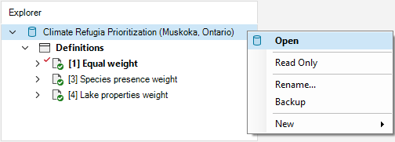

## **Climate Refugia Prioritization with prioritizr SyncroSim**

This tutorial provides an overview of working with **prioritizr** in SyncroSim Studio to prioritize climate refugia in aquatic systems - specifically, applied to cold-water species for a subset of lakes within the Muskoka watershed, Ontario, Canada. It covers the following steps:

1. <a href="#step-1">Creating and configuring the prioritizr **Climate Refugia Prioritization (Muskoka, Ontario)** SyncroSim library</a>
2. <a href="#step-2">Visualizing and comparing results across scenarios</a>

 

 <h3><b>Step 1. Creating and configuring the Climate Refugia Prioritization (Muskoka, Ontario) library</b></h3> 

In SyncroSim, a library is a file with extension *.ssim* that stores all the model's inputs and outputs in a format specific to a given package. To recreate the **Climate Refugia Prioritization (Muskoka, Ontario)** library:

1\. Open SyncroSim Studio.

2\. In this example, you will review a pre-configured library. To do so, select **File > New > From Online Template...**

a. From the list of packages, select <b>prioritizr</b>. 

  

b. Three template library options will be available: Spatial Formulation Example, Tabular Formulation Example, and Climate Refugia Prioritization (Muskoka, Ontario). Select the <b>Climate Refugia Prioritization (Muskoka, Ontario)</b> template library.

  

c. If desired, you may edit the <i>File name</i>, and change the <i>Folder</i> by clicking on the <b>Browse</b> button. 

  

d. When done, click <b>OK</b>.

 

A new library has been created based on the selected template and SyncroSim will have automatically opened and displayed it in the *Explorer* window.

3\.	Double-click on the library name, **Climate Refugia Prioritization (Muskoka, Ontario)**, to open the library properties window. You may also right-click on the library name and select **Open** from the context menu.

 

4\.	The **Summary** datasheet contains the metadata for the library.

 

5\.	Next, navigate to the **Systems** tab, **Options** node, **General** datasheet, and mark the checkbox for *Use conda*.

 

6\.	Close the library properties window.

 

Next, you will review the target feature data for the conservation prioritization problem.

7\. From the *Explorer* window, right-click on **Definitions** and select **Open** from the context menu.

8\. Under the **Prioritizr** tab, select the **Features** datasheet, describing the variables that will be taken into account in the prioritization process. Here, our feature data corresponds to different conservation interests including species presence (*i.e.*, Brook Trout and Lake Trout), and lake properties (*i.e.*, Epi-benthic Habitat, Mean Depth, and Surface Area).

 

Now you will review the inputs for the **Equal weight** scenario. In SyncroSim, scenarios contain the model inputs and outputs associated with a model run.

9\.	In the *Explorer* window, select the pre-configured scenario **Equal weight** and double-click it to open its properties. You may also right-click on the scenario name and select **Open** from the context menu.

This scenario provides a baseline under which all features have the same weight, and considers two criteria: species presence, and lake properties.

 

10\.	Navigate to the **Pipeline** datasheet. Pipeline stages call on a transformer (*i.e.*, script) which takes the inputs from SyncroSim, runs a model, and returns the results to SyncroSim. Under the *Stage* column, note that a single pipeline stage is set called *Base Prioritization*.

 

11\. Navigate to the **Prioritizr** tab, and expand the **Base Prioritization > Data** nodes. 

  a. Open the <b>Input Format</b> node and notice that <i>Data Type</i> is set to <i>Tabular</i> in order to generate a tabular prioritization.

  b. Open the <b>Spatial Inputs</b> datasheet, and review the following input:
   
  

    i. <i>Planning Units</i> - a raster of the different lakes of interest in Muskoka, Ontario.
  

  c. Open the <b>Tabular Inputs</b> datasheet, and review the following inputs:
   
  

    i. <i>Planning Units</i> - a data table of the different lakes of interest in Muskoka, Ontario.
      
      
      
    ii. <i>Features</i> - a data table of the conservation feature data including species presence, and lake properties.
      
      
      
    iii. <i>Planning units vs. Features</i> - a data table of the species presence, and lake property features associated with each lake.
      
      
      
    iv. <i>Cost column</i> - a column in which the cost is input <!--not sure if this makes sense - is this simply an empty column in which the cost is input in the results?-->
  

 

12\. Expand the **Parameters** node. 

  a. Open the <b>Objective</b> datasheet, and review the following inputs:
   
  

    i. <i>Function</i> - this input sets the objective of the conservation planning problem. In this example, it is set to <i>Minimum shortfall</i> which aims to minimize the fraction of each target that remains unmet for as many features as possible while staying within a fixed budget.
      
    ii. <i>Budget</i> - this number represents the maximum allowed cost of the prioritization. Specifically, this value is set to <i>$5,000</i>.
  

  b. Open the <b>Target</b> datasheet, and review the following inputs:
   
  

    i. <i>Function</i> - since this input is set to <i>Relative</i>, so that the target may be defines as a proportion (between 0 and 1) of the desired level of feature representation (<i>i.e.</i>, species presence and lake properties) in Muskoka. Ontario.
      
    ii. <i>Amount</i> - specifies the desired level of feature representation in the study area. In this example, it is set to 1.0, so that each feature would have 100% of its distribution covered by the prioritization.
  

  c. Open the <b>Decision Types</b> datasheet, and review the following input:
   
  

    i. <i>Function</i> - the decision type is set to <i>Binary</i>, so that planning units are either selected or not for prioritization (<i>i.e.</i>, to prioritize or not prioritize a lake). 
  

  d. Open the <b>Solver</b> datasheet, and review the following inputs:
   
  

    i. <i>Function</i> - is set to <i>Default</i>. This specifies that the best solver currently available in your computer should be used to solve the conservation planning problem. 
      
    ii. <i>Gap</i> - represents the gap to optimality and is set to a value of <i>0</i>. This gap is relative and expresses the acceptable deviance from the optimal objective. In this example, a value of 0 will result in the solver stopping when it has found a solution within 0% of optimality. <!-- does this make sense?-->
  

 

13\. Expand the **Output Options** node and open the **Performance** datasheet to review the following inputs set to *Yes*:

  

    i. <i>Number Summary</i> - calculates the number of lakes selected within a solution to the conservation planning problem.
      
    ii. <i>Feature representation summary</i> - calculates how well features (<i>i.e.</i>, species presence, and lake properties) are represented by a solution to the conservation planning problem.
  

 

14\. Open the **Importance** datasheet to review the following inputs set to *Yes*:

  

    i. <i>Replacement cost</i> - calculates importance scores for the lakes selected in the solution based on the replacement cost method. <!--cite Cabeza and Moilanen, 2006?-->
  

 

 <h3><b>Step 2. Visualizing and comparing results across scenarios</b></h3> 

The *Climate Refugia Prioritization (Muskoka, Ontario)* template library already contains the results for each scenario. Before exploring additional scenarios, you will view the main results for the **Equal Weight** scenario.

By running the **Equal weight** scenario, we generate a baseline solution<!--that helps meet the representation targets?-->.

1\. In the *Explorer* window, expand the **Equal weight > Results** node to reveal the **Equal weight** result scenario. Double-click it to open its properties. You may also right-click on the result scenario name and select **Open** from the context menu.

 

2\. Collapse the scenario node by clicking on the downward facing arrow beside the scenario name.

3\. Navigate to the **Prioritizr** tab, and expand the **Results > Spatial** node. Select the **Solution** datasheet to view the spatial results. <!--include?-->

4\. Navigate to the **Prioritizr** tab, and expand the **Results > Spatial** node. Select the **Replacement** datasheet to view the spatial results. <!--include?-->

5\. Navigate to the **Prioritizr** tab, and expand the **Results > Tabular** node. Select the **Solution** datasheet to analyse the tabular results table. To view which planning units were selected (1), and their associated costs, click on the *Solution* column to reorder the table's contents.

6\. Close the results panels.

 

Now, you will review the additional scenarios and explore how they differ from the *Equal weight* scenario. 

The **Species presence weight** scenario is a copy of the **Equal weight** scenario; the only difference is the inclusion of **Feature weights** (all other inputs remain the same). 

7\. In the *Explorer* window, select the pre-configured scenario **Species presence weight** and double-click it to open its properties. You may also right-click on the scenario name and select **Open** from the context menu.

8\. Navigate to the **Prioritizr** tab, and expand the expand the **Advanced** node. Select **Feature weights** to review the following inputs: 

  a. <i>Add feature weights</i> - is set to <i>Yes</i> to add feature weights to the conservation planning problem.
    
  b. <i>Weights</i> - a data table outlining the weight of each species presence feature. 

 

9\. In the *Explorer* window, right-click on the **Species presence weight** scenario, and select **Add to Results** from the context menu.

 

Similarly, the **Lake properties weight** scenario is a copy of the **Equal weight** scenario; the only difference is the inclusion of **Feature weights** as well (all other inputs remain the same). 

10\. In the *Explorer* window, select the pre-configured scenario **Lake properties weights** and double-click it to open its properties. You may also right-click on the scenario name and select **Open** from the context menu.

11\. Navigate to the **Prioritizr** tab, and expand the expand the **Advanced** node. Select **Feature weights** to review the following inputs: 

  a. <i>Add feature weights</i> - is set to <i>Yes</i> to add feature weights to the conservation planning problem.
    
  b. <i>Weights</i> - a data table outlining the weight of each lake properties feature. 

 

12\. In the *Explorer* window, right-click on the **Species presence weight** scenario, and select **Add to Results** from the context menu.

 

13\. Navigate to the **Charts** tab, and double-click on the first pre-configured chart: **Feature representation**. This chart displays the proportion of each feature secured within the solution.

 

14\. Next, double-click on the second pre-configured chart: **Number of planning units**. This chart displays the total number of planning units per scenario. In this example, there are 5 lakes.

 

15\. Next, navigate to the **Maps** tab, and double-click on the first pre-configured map: **Replacement importance**. This map displays the importance scores for each lake selected in the solution based on the replacement cost method. <!--cite Cabeza and Moilanen, 2006?-->

 

16\. Finally, double-click on the second pre-configured map: **Solution**. This map displays the lakes that were selected within a solution to the conservation planning problem. 

