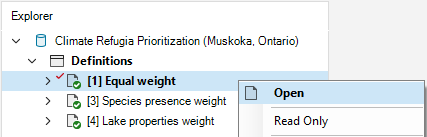

## **Climate Refugia Prioritization with prioritizr SyncroSim**

This tutorial provides an overview of working with **prioritizr** in SyncroSim Studio to prioritize climate refugia in aquatic systems - specifically, applied to cold-water species for a subset of lakes within the Muskoka watershed, Ontario, Canada. It covers the following steps:

1. <A href="#step-1">Creating and configuring the **Climate Refugia Prioritization (Muskoka, Ontario)** SyncroSim library using **prioritizr**</A>
2. <A href="#step-2">Visualizing and comparing results across scenarios</A>

 

 <h3><b>Step 1. Creating and configuring the Climate Refugia Prioritization (Muskoka, Ontario) library</b></h3> 

In SyncroSim, a library is a file with extension *.ssim* that stores all the model's inputs and outputs in a format specific to a given package. To recreate the **Climate Refugia Prioritization (Muskoka, Ontario)** library:

1\. Open SynrcoSim Studio.

2\. Select **File > New > From Online Template...**

a. From the list of packages, select <b>prioritizr</b>. Three template library options will be available: 1.) Spatial Formulation Example, 2.) Tabular Formulation Example, and 3.) Climate Refugia Prioritization (Muskoka, Ontario). <!-- double check that this is what the template library file will be named-->
  
b. Select the <b>Climate Refugia Prioritization (Muskoka, Ontario)</b> template library. If desired, you may edit the <i>File name</i>, and change the <i>Folder</i> by clicking on the <b>Browse</b> button. Click <b>OK</b>.

<!--Insert image of template library window-->
<!--img align="center" style="padding: 13px" width="500" src=".assets/images/screenshot55.png"-->

A new library has been created based on the selected template. SyncroSim will automatically open and display it in the Explorer window.

3\.	Double-click on the library name, **Climate Refugia Prioritization (Muskoka, Ontario)**, to open the library properties window. You may also right-click on the library name and select **Open** from the context menu.

4\.	The **Summary** datasheet contains the metadata for the library.

5\.	Next, navigate to the **Systems > Options** node.

 
Under <i>General</i>, mark the checkbox for <i>Use conda</i>.

6\.	Close the library properties window.

 

Next, you will review the conservation feature data by right-clicking on **Definitions** and selecting **Open** in the context menu. Under the **Prioritizr** tab, select **Features**. Here, our feature data corresponds to different conversation interests including species presence (*i.e.*, Brook Trout and Lake Trout), and lake properties (*i.e.*, Epi-benthic Habitat, Mean Depth, and Surface Area).

 

Now, you will review the inputs of each scenario in the **Climate Refugia Prioritization (Muskoka, Ontario)** library including: 1.) *Equal weight*, 2.) *Species presence weight*, and 3.) *Lake properties weight*. In SyncroSim, scenarios contain the model inputs and outputs associated with a model run.

1\.	In the *Explorer* window, select the pre-configured scenario **Equal weight** and double-click it to open its properties. You may also right-click on the scenario name and select **Open** from the context menu.

This scenario provides a baseline under which all features have the same weight, and considers two criteria: species presence, and lake properties.

 

2\.	Navigate to the **Pipeline** datasheet. Pipeline stages call on a transformer (*i.e.*, script) which takes the inputs from SyncroSim, runs a model, and returns the results to SyncroSim. Under the *Stage* column, note that a single pipeline stage is set called *Base Prioritization*.

 

3\. Navigate to the **Prioritizr** tab, and expand the **Base Prioritization > Data** node. 

  a. Click on the <b>Input Format</b> node and notice that <i>Data Type</i> is set to <i>Tabular</i> in order to generate a tabular prioritization.

  b. Navigate to the <b>Spatial Inputs</b> node, and review the following input:
   
  

    i. <i>Planning Units</i> - a raster of the different lakes of interest in Muskoka, Ontario.
  

  c. Navigate to the <b>Tabular Inputs</b> node, and review the following inputs:
   
  

    i. <i>Planning Units</i> - a data table of the different lakes of interest in Muskoka, Ontario.
      
    ii. <i>Features</i> - a data table of the conservation feature data including species presence, and lake properties.
      
    iii. <i>Planning units vs. Features</i> - a data table of the species presence, and lake property features associated with each lake.
      
    iv. <i>Cost column</i> - a column in which the cost is input <!--not sure if this makes sense - is this simply an empty column in which the cost is input in the results?-->
  

4\. Expand the **Base Prioritization > Parameters** node. 

  a. Click on the <b>Objective</b> node, and review the following inputs:
   
  

    i. <i>Function</i> - this input sets the objective of the conservation planning problem. In this example, it is set to <i>Minimum shortfall</i> which aims to minimize the overall shortfall for as many targets as possible while ensuring that the cost of a solution does not exceed a budget.
      
    ii. <i>Budget</i> - this number represents the total cost of the prioritization. Specifically, this value is set to <i>$5,000</i>.
  

  b. Click on the <b>Target</b> node, and review the following inputs:
   
  

    i. <i>Function</i> - since this input is set to <i>Relative</i>, the targets are set as a proportion (between 0 and 1) of the maximum level of representations of features (<i>i.e.</i>, species presence and lake properties) in the Muskoka. Ontario.
      
    ii. <i>Amount</i> - specifies the proportion. In this example, it is set to <i>1.0</i>.
  

  c. Click on the <b>Decision Types</b> node, and review the following input:
   
  

    i. <i>Function</i> - is set to <i>Binary</i>. Here, we are adding a binary decision to the conservation planning problem (<i>i.e.</i>, to prioritize or not prioritize a lake). 
  

  d. Click on the <b>Solver</b> node, and review the following inputs:
   
  

    i. <i>Function</i> - is set to <i>Default</i>. This specifies that the best solver currently available should be used to solve the conservation planning problem. 
      
    ii. <i>Gap</i> - represents the gap to optimality and is set to a value of <i>0</i>. This gap is relative and expresses the acceptable deviance from the optimal objective. In this example, a value of 0 will result in the solver stopping when it has found a solution within 0% of optimality. <!-- does this make sense?-->
  

 

5\. Exapnd the **Output Options** node and click on **Performance** to review the following inputs:

  a. Click on the <b>Performance</b> node, and review the following inputs set to *Yes*:
   
  

    i. <i>Number Summary</i> - calculates the number of lakes selected within a solution to a the conservation planning problem.
      
    ii. <i>Feature representation summary</i> - calculates how well features (<i>i.e.</i>, species presence, and lake properies) are represented by a solution to the conservation planning problem.
  

  b. Click on the <b>Importance</b> node, and review the following input set to <i>Yes</i>:
   
  

    i. <i>Replacement cost</i> - calculates importance scores for the lakes selected in the solution based on the replacement cost method. <!--cite Caseza and Moilanen, 2006?-->
  

 

By running the **Equal weight** scenario, we generate a baseline solution<!--that helps meet the representation targets?-->.

6\. In the *Explorer* window, expand the **Equal weight > Results** folder and double-click the results scenario to open it. 

 

<!-- Go over Prioritizr > Results > Spatial and Tabular result outputs?-->

 

The **Species presence weight** scenario is a copy of the **Equal weight** scenario; the only difference is the inclusion of **Feature weights** (all other inputs remain the same). Open the **Species presence weight** scenario and navigate to the **Prioritizr** tab.

1\. Expand the **Advanced** node and select **Feature weights** to review the following inputs: 

  a. <i>Add feature weights</i> - is set to <i>Yes</i> to add feature weights to the conservation planning problem.
   
  b. <i>Weights</i> - a data table outlining the weight of each species presence feature. 

 

Similarily, the **Lake properties weight** scenario is a copy of the **Equal weight** scenario; the only difference is the inclusion of **Feature weights** as well (all other inputs remain the same). Open the **Lake properties weights** scenario and navigate to the **Prioritizr** tab.

1\. Expand the **Advanced** node and select **Feature weights** to review the following inputs: 

  a. <i>Add feature weights</i> - is set to <i>Yes</i> to add feature weights to the conservation planning problem.
   
  b. <i>Weights</i> - a data table outlining the weight of each lake properties feature. 

 <h3><b>Step 2. Visualizing and comparing results across scenarios</b></h3> 

The **Climate Refugia Prioritization (Muskoka, Ontario)** template library already contains the results for each scenario. In SyncroSim, the results for a scenario are organized into a *Results* folder, nested within its parent scenario.

1\. Navigate to the **Charts** tab, and double-click on the first pre-configured chart: **Feature representation**. 

This chart displays the proportion of each feature secured within the solution.

2\. Next, double-click on the second pre-configured chart: **Number of planning units**.

This chaty displays the total number of planning units per scenario. In this example, there are 5 lakes.

3\. Next, navigate to the **Maps** tab, and double-click on the first pre-configured map: **Replacement importance**.

This map displays the importance scores for each lake sleected in the solution based on the replacement cost method. <!--cite Cabeza and Moilanen, 2006?-->

4\. Finally, double-click on the second pre-configured map: **Solution**.

This map displays the lakes that were selected within a solution to the conservation planning problem. 

