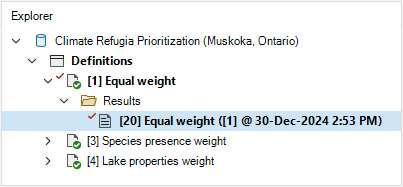
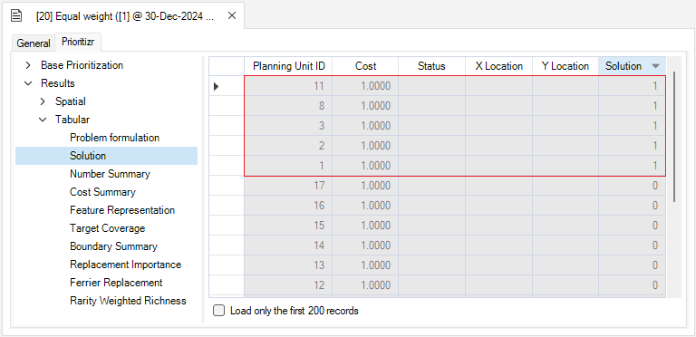

## **Climate refugia prioritization with prioritizr SyncroSim**

This tutorial provides an overview of working with **prioritizr** in SyncroSim Studio to create a simplified version of a climate-refugia prioritization approach that explores the effects of different criteria and feature weighing schemes on the results. It covers the following steps:

1. <a href="#step-1">Creating a prioritizr SyncroSim library</a>
2. <a href="#step-2">Visualizing and comparing results across scenarios</a>

 

 <h3><b>Step 1. Creating a prioritizr SyncroSim library</b></h3> 

In SyncroSim, a library is a file with extension *.ssim* that stores all the model's inputs and outputs in a format specific to a given package. To load the pre-configured library:

1\. Open **SyncroSim Studio**.

2\. Select **File > New > From Online Template...**.

a. From the list of packages, select <b>prioritizr</b>. 
  

  
b. From the list of template libraries, select <b>Climate Refugia Prioritization (Muskoka, Ontario)</b>.
  

  
c. If desired, you may edit the <i>File name</i>, and change the <i>Folder</i> by clicking on the <b>Browse</b> button. 
  
d. When done, click <b>OK</b>.

 

A new library has been created based on the selected template, and SyncroSim will have automatically opened and displayed it in the *Explorer* window.

3\.	Double-click on the library name, **Climate Refugia Prioritization (Muskoka, Ontario)**, to open the library properties window. You may also right-click on the library name and select **Open** from the context menu.

4\.	The **Summary** datasheet contains the metadata for the library.

5\.	Next, navigate to the **Systems** tab, **Options** node, **General** datasheet, and make sure **Use conda** is disabled.

6\.	Close the library properties window.

 

Next, you will review the target feature data for the conservation prioritization problem.

7\. From the *Explorer* window, right-click on **Definitions** and select **Open** from the context menu.

8\. Under the **Prioritizr** tab, select the **Features** datasheet, which lists the variables that will be taken into account in the prioritization process. Here, the feature data corresponds to three lake property variables (*i.e.*, Epi-benthic Habitat, Mean Depth, and Surface Area) and two species occurence records (*i.e.*, for Brook Trout and Lake Trout). This datasheet was automatically populated once the first scenario was run.

 

Now you will review the inputs for the **Equal weight** scenario, which provides a baseline where all features have the same weight. In SyncroSim, each scenario contains the model inputs associated with a model run. 

9\.	In the *Explorer* window, select the pre-configured scenario **Equal weight** and double-click it to open its properties. You may also right-click on the scenario name and select **Open** from the context menu.

10\.	Navigate to the **Pipeline** datasheet. Pipeline stages call on a transformer (*i.e.*, script) which takes the inputs from SyncroSim, runs a model, and returns the results to SyncroSim. Under the *Stage* column, note that a single pipeline stage is set called *Base Prioritization*.

11\. Navigate to the **Prioritizr** tab and expand the **Base Prioritization > Data** nodes. 

  a.  Open the <b>Input Format</b> datasheet and review the following inputs:
  

    i. <i>Data Type</i> – set to <i>Tabular</i> in order to setup a tabular formulation of the conservation problem. This means that csv files are provided as input.
  

  b. Open the <b>Spatial Inputs</b> datasheet, and review the following input:
   
  

    i. <i>Planning units</i> – a raster of the different lakes of interest in Muskoka, Ontario. While the problem has a tabular formulation, a raster may be provided to generate a map of the solution.
  

  c. Open the <b>Tabular Inputs</b> datasheet, and review the following inputs:
   

  

   

  

    i. <i>Planning Units</i> – a data table of the different lakes of interest in Muskoka, Ontario. Each lake has an unique ID. A <i>cost</i> column is also provided and set to <i>1</i> for all lakes.
     
    
      
    ii. <i>Features</i> – a data table listing the feature variables. These are listed under the column <i>name</i>, with an associated ID. 
     
    
      
    iii. <i>Planning units vs. Features</i> – a data table listing for each lake (under the <i>pu</i> column), the value (under the <i>amount</i> column) associated with each feature variable (under the <i>species</i> column).
     
      
      
    iv. <i>Cost column</i> – corresponds to the column in the <i>Planning units</i> input representing the cost variable.
      
  

12\. Expand the **Parameters** node. 

  a. Open the <b>Objective</b> datasheet and review the following inputs:
   
  

    i. <i>Function</i> – this input sets the objective of the conservation planning problem. In this example, it is set to <i>Minimum shortfall</i> which aims to minimize the fraction of each target that remains unmet for as many features as possible while staying within a fixed budget.
      
    ii. <i>Budget</i> – this number represents the maximum allowed cost of the prioritization. Here, the budget is used to ensure that 30% of lakes in the study area are represented in the solution, which corresponds to <i>5</i>.
  

  b. Open the <b>Target</b> datasheet and review the following inputs:
   
  

    i. <i>Function</i> – is set to <i>Relative</i> so that the target may be defined as a proportion (between 0 and 1) of the desired level of feature representation in the study area.
      
    ii. <i>Amount</i> – specifies the desired level of feature representation in the study area. In this example, it is set to 1.0, so that each feature would ideally have 100% of its distribution covered by the prioritization.
  

  c. Open the <b>Decision Types</b> datasheet and review the following input:
   
  

    i. <i>Function</i> – the decision type is set to <i>Binary</i>, so that planning units are either selected or not for prioritization (<i>i.e.</i>, to prioritize or not prioritize a lake). 
  

  d. Open the <b>Solver</b> datasheet and review the following inputs:
   
  

    i. <i>Function</i> – is set to <i>Default</i>. This specifies that the best solver currently available in your computer should be used to solve the conservation planning problem. 
      
    ii. <i>Gap</i> – represents the gap to optimality and is set to a value of <i>0</i>. This gap is relative and expresses the acceptable deviance from the optimal objective. In this example, a value of 0 will result in the solver only stopping when it has found the best possible solution.
  

13\. Expand the **Output Options** node and open the **Performance** datasheet to review the following inputs set to *Yes*:

  

    i. <i>Number summary</i> – calculates the number of lakes selected in the solution to the conservation planning problem.
      
    ii. <i>Feature representation summary</i> – calculates how well features are represented by the solution to the conservation planning problem.
  

14\. Open the **Importance** datasheet to review the following inputs set to *Yes*:

  

    i. <i>Replacement cost</i> – calculates the importance scores for the lakes selected in the solution.
  

 

 <h3><b>Step 2. Visualizing and comparing results across scenarios</b></h3> 

The *Climate Refugia Prioritization (Muskoka, Ontario)* template library already contains the results for each scenario. Before exploring additional scenarios, you will view the main results for the **Equal Weight** scenario.

1\. In the *Explorer* window, expand the **Equal weight > Results** nodes to reveal the **Equal weight** result scenario. This scenario contains the outputs of the model run, it is timestamped, and has a copy of all the input parameters.

2\. Double-click on the **Equal weight** result scenario to open its properties. You may also right-click it and select **Open** from the context menu.

  a. Navigate to the <b>Prioritizr</b> tab, expand the <b>Results > Tabular</b> nodes, and open the <b>Solution</b>> datasheet to analyse the tabular results table of the solution. 
    
  b. Click on the <b>Solution</b> column to reorder the table's contents in decreasing order. <i>Solution</i> values equal to 1 represent the planning units that were selected by the solution.

3\. Close the scenario properties tab, and from the *Explorer* window, collapse the scenario node by clicking on the downward facing arrow beside the **Equal weight** scenario.

4\. Navigate to the **Maps** tab, and double-click on the pre-configured **Solution** map. This map displays a visual representation of the tabular result you just inspected, showing the lakes that were selected in the solution to the conservation planning problem. 

5\. Close the results panels.

 

Now, you will review the additional scenarios, which are equal to the *Equal weight* scenario for all but one input: the **Feature weights**. Feature weights are an advanced way of controling the relative importance of different features in the prioritization process. 

6\. In the *Explorer* window, select the pre-configured scenario **Species presence weight** and double-click it to open its properties. You may also right-click on the scenario name and select **Open** from the context menu.

7\. Navigate to the **Prioritizr** tab, expand the **Advanced** node, and open the **Feature weights** datasheet to review the following inputs: 

  a. <i>Add feature weights</i> – is set to <i>Yes</i> to add feature weights to the conservation planning problem.
    
  b. <i>Weights</i> – a data table outlining the weight of feature. From Step 1.c.ii, recall that features 1 and 2 represent the species presence features <i>LakeTrout</i> and <i>BrookTrout</i>. Here, both species presence variables have the same weight of 1, and all lake property variables have a weight of 0. In essence, this means that in this scenario, only the species presence features will be considered in the prioritization process, and will be treated with equal importance.

8\. In the *Explorer* window, select the pre-configured scenario **Lake properties weights** and double-click it to open its properties.

9\. Navigate to the **Prioritizr** tab, expand the **Advanced** node, and open the **Feature weights** datasheet to note the input *Weights*. Here, both species presence variables now have a weight of 0, and all lake property variables have the same weight of 1. In essence, this means that in this scenario, only the lake property features will be considered in the prioritization process.

<!-- Update screenshot !-->

10\. In the *Explorer* window, select scenarios **Species presence weight** and **Lake properties weights**, right-click and select **Add to Results** from the context menu.

11\. Navigate to the **Charts** tab, and double-click on the pre-configured **Number of planning units** chart. This chart displays the total number of planning units in the solution per scenario. In this example, 5 lakes were selected in the solution, showing the budget was met in all three scenarios.

12\. Next,  double-click on the pre-configured **Feature representation** chart. This chart shows the effect of the feature weights on the proportion of each feature secured within the solution. Note that feature representation for the species presences features (i.e., *BrookTrout* and *LakeTrout*) are generally higher under the *Species presence weight* scenario, and the lake property features (i.e., *EpiBent*, *MeanDepth* and *SurfArea*) are generally higher under the *Lake properties weights* scenario.

13\. Next, navigate to the **Maps** tab, and double-click on the pre-configured **Solution** map. This map displays the lakes that were selected in the solution under each scenario. Note that some lakes were selected in every scenario. 

15\. Finally, double-click on the pre-configured **Replacement importance** map. This map displays the importance scores for each lake selected in the solution based on the replacement cost method. Note that the lakes that were always selected also tended to have higher scores.

 

This tutorial demonstrated how **prioritizr** can be used to build tabular formulations of conservation problems, with a spatial visualization of the results, and covered how to add feature weights to control the relative importance of features in the prioritization. Next, to explore how to further customize a conservation problem with multiple cost layers, see the next tutorial <a href="/multicost_prioritization">Multi-Cost Prioritization with prioritizr SyncroSim</a>. 

   
