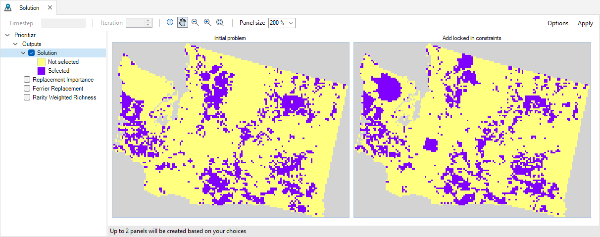

# Getting started with **prioritizr** 

To get started working with **prioritizr** SyncroSim for building and solving conservation planning problems, begin by:

1. <a href="#installing-syncrosim">Installing SyncroSim</a>
2. <a href="#installing-the-prioritizr-syncrosim-package">Installing the **prioritizr** SyncroSim package</a>
3. <a href="#installing-rtools">Installing Rtools</a>

<br>

## **Installing SyncroSim**

Running **prioritizr** requires that **SyncroSim** be installed on your computer. Download the latest version of SyncroSim for Windows [here](https://syncrosim.com/download/){:target="_blank"} and follow the installation prompts. For more on SyncroSim, please refer to the SyncroSim Docs for an [overview](https://docs.syncrosim.com/getting_started/overview.html){:target="_blank"} and a [quickstart tutorial](https://docs.syncrosim.com/getting_started/quickstart.html){:target="_blank"}.

<br>

## **Installing the prioritizr SyncroSim package**

1\. Open **SyncroSim Studio**.

2\. Navigate to **File > Local Packages**.


3\. The *Local Packages* window will open, listing all the SyncroSim packages installed on your computer. If you do not have any packages installed yet, this window will be empty. To install a new package from the Package Server, click on **Install from Server...**. 


4\. A new window will open listing the packages available to install from the Package Server. To install **prioritizr**, click the checkbox beside the package name and select **OK**. 


5\. The **prioritizr** SyncroSim package uses Conda to manage the package dependencies. Upon installing the package, you will be prompted to install Conda (if it is not already installed on your computer). Then, you will be prompted to create or update the Conda environment for **prioritzr**. Click **Yes**.


6\. Return to the *Local Packages* window. **prioritizr** will now be listed along with the other installed packages and the Conda checkbox will be marked.


<br>

## **Installing Rtools**

1\. Download [Rtools 4.0](https://github.com/r-windows/rtools-installer/releases/download/2022-02-06/rtools40-x86_64.exe){:target="_blank"} and follow the **default** installation prompts.

2\. Once the installation process is complete, you will need to add Rtools’ utilities to the PATH. To do so, create a text file and paste the following:

```
PATH="${RTOOLS40_HOME}\usr\bin;${PATH}"
```

3\. Name the text file **.Renviron** and save it in your home directory (*i.e.*, **Documents** folder). If you are unsure of your home directory, open an R terminal and run the command `Sys.getenv("HOME")` to check.

4\. From the Windows toolbar, search for **View advanced system settings**.

5\. Open the application and under the **Advanced** tab, click on **Environment Variables…**.

6\. Under **System Variables**, double-click on **Path** to edit the environment variable.

7\. Click on the **New** button and paste the following:

```
C:\rtools40\mingw64\bin
```

8\. If you have a newer version of Rtools installed, use the **Move Up** button to make sure the path to Rtools 4.0 is above the other versions so it will be used first.

9\. Click **OK** three times to save and close the application.

10\. Restart your computer for changes to take effect.

11\. If you have R or RStudio installed on your computer, you can check if the installation process was successful by running the following command:

```
Sys.which("make")
```

12\. This command should return the path of the Rtools 4.0 installation.

```
"C:\\rtools40\\usr\\bin\\make.exe"
```

If the command above returns a different or an empty path, or if when running a prioritizr SyncroSim scenario it returns a "The installation of Rtools v4.0 is faulty" error message, please see this [forum post](https://community.syncrosim.com/forums/topic/troubleshooting-rtools-installation-for-prioritizr-2-2-2) for help troubleshooting.

<br>

## **Next steps**

Once the requirements have been installed, the following tutorials will cover the basics of **prioritizr** SyncroSim for building and solving conservation planning problems: 
1. <a href="./tutorials/spatial_formulation">Spatial conservation prioritization with prioritizr SyncroSim<a>
2. <a href="./tutorials/tabular_formulation">Tabular conservation prioritization with prioritizr SyncroSim</a>
3. <a href="./tutorials/climate_refugia_prioritization">Climate refugia prioritization with prioritizr SyncroSim</a>
4. <a href="./tutorials/multicost_prioritization">Multi-cost prioritization with prioritizr SyncroSim</a>



<br><br><br>
