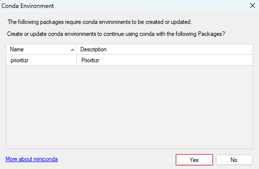

# Getting started with **prioritizr**

### Here we provide a guided tutorial on **prioritizr**, an open-source SyncroSim package for building and solving conservation planning problems.

 

**prioritizr** is built as a package for SyncroSim, yet familiarity with SyncroSim is not required to get started with **prioritizr**. Throughout the Quickstart tutorial, terminology associated with SyncroSim will be italicized, and whenever possible, links will be provided to the SyncroSim online documentation. For more on SyncroSim, please refer to the SyncroSim [Overview](https://docs.syncrosim.com/getting_started/overview.html){:target="_blank"} and [Quickstart tutorial](https://docs.syncrosim.com/getting_started/quickstart.html){:target="_blank"}.

 

## **prioritizr** Quickstart tutorial

This Quickstart tutorial will introduce you to the basics of working with **prioritizr**. The steps include:

1. Installing SyncroSim
2. Installing **prioritizr**

 

## Step 1: Installing SyncroSim

Running **prioritizr** SyncroSim requires that SyncroSim be installed on your computer. Download the latest version of SyncroSim [here](https://syncrosim.com/download/){:target="_blank"} and follow the installation prompts.

## Step 2: Installing **prioritizr** SyncroSim package

**prioritizr** is a [*package*](https://docs.syncrosim.com/how_to_guides/package_overview.html){:target="_blank"} within the SyncroSim simulation modeling framework. To install the **prioritizr** *package*, follow the steps below:

1\. Open SyncroSim Studio.

2\. Navigate to **File > Local Packages**.

3\. The *Local Packages* window will open, listing all the SyncroSim *packages* installed on your computer - if you do not have any *packages* installed yet, this window will be empty. To install a new *package* from the Package Server, click on *Install from Server...*. 

<!--Add image here of red box around Install from Server... in Local Packages window-->

4\. A new window will open listing the *packages* available to install from the Package Server. To install **prioritizr** SyncroSim, click the checkbox besdie the *package* name and select **OK**. 

<!--Add image here of red box around checkbox beside prioritizr package name, and OK button-->

5\. The **prioritizr** SyncroSim *package* uses Conda to manage the package dependencies. Upon installing the package, you will be prompted to install Conda if it is not already installed on your computer. Then, you will be prompted to create or update the Conda environment for **prioritzr** SyncroSim. Click **Yes**.

6\. Return to the *Local Packages* window, **prioritizr** will now be listed along with the other installed *packages*, and the Conda checkbox will be marked.

 

## **Next Steps**

Once the requirements have been installed, the following tutorials will cover the basics of the **prioritizr** Syncrosim *package* for building and solving conservation planning problems. 

<!--Add a list of links to the tutorials-->

<!--Add image of prioritizr output maps/charts-->

   
