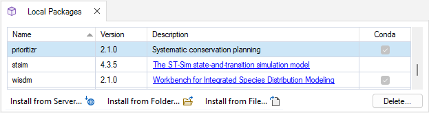

# Getting started with **prioritizr** 

To get started working with **prioritizr** SyncroSim for building and solving conservation planning problems, begin by:

1. <a href="#installing-syncrosim">Installing SyncroSim</a>
2. <a href="#installing-R-package-dependencies">Installing R package dependencies</a>
3. <a href="#installing-the-prioritizr-syncrosim-package">Installing the **prioritizr** SyncroSim package</a>

 

## **Installing SyncroSim**

Running **prioritizr** requires that **SyncroSim** be installed on your computer. Download the latest version of SyncroSim [here](https://syncrosim.com/download/){:target="_blank"} and follow the installation prompts. For more on SyncroSim, please refer to the SyncroSim Docs for an [overview](https://docs.syncrosim.com/getting_started/overview.html){:target="_blank"} and a [quickstart tutorial](https://docs.syncrosim.com/getting_started/quickstart.html){:target="_blank"}.

 

## **Installing R package dependencies**

Running **prioritizr** requires the following R packages be installed in your computer:
- prioritizr 8.0.4
- symphony 0.1.1
- Rsymphony 0.1-33
- rsyncrosim 2.0.0
- stringr 1.4.1
- terra 1.7-29
- tidyr 1.2.1
- dplyr 1.1.1 

 

## **Installing the prioritizr SyncroSim package**

1\. Open **SyncroSim Studio**.

2\. Navigate to **File > Local Packages**.

3\. The *Local Packages* window will open, listing all the SyncroSim packages installed on your computer. If you do not have any packages installed yet, this window will be empty. To install a new package from the Package Server, click on **Install from Server...**. 

4\. A new window will open listing the packages available to install from the Package Server. To install **prioritizr**, click the checkbox beside the package name and select **OK**. 

<!--Once prioritizr is on the server --- Add image here of red box around checkbox beside prioritizr package name, and OK button-->

5\. The **prioritizr** SyncroSim package uses Conda to manage the package dependencies. Upon installing the package, you will be prompted to install Conda (if it is not already installed on your computer). Then, you will be prompted to create or update the Conda environment for **prioritzr**. Click **Yes**.

6\. Return to the *Local Packages* window. **prioritizr** will now be listed along with the other installed packages and the Conda checkbox will be marked.

 

## **Next steps**

Once the requirements have been installed, the following tutorials will cover the basics of **prioritizr** SyncroSim for building and solving conservation planning problems: 
1. <a href="./spatial_formulation">Spatial conservation prioritization with prioritizr SyncroSim<a>
2. <a href="./tabular_formulation">Tabular conservation prioritization with prioritizr SyncroSim</a>
3. <a href="./climate_refugia_prioritization">Climate refugia prioritization with prioritizr SyncroSim</a>
4. <a href="./multicost_prioritization">Multi-cost prioritization with prioritizr SyncroSim</a>

   
