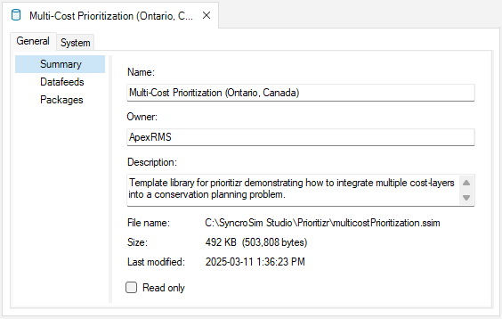
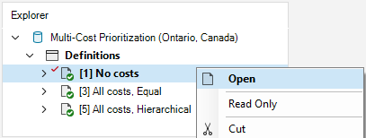
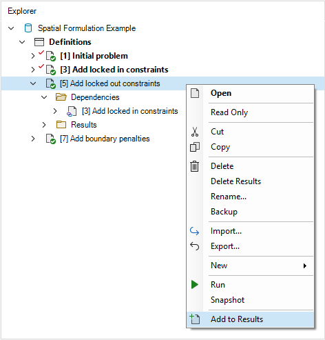

## **Multi-cost Prioritization with prioritizr SyncroSim**

This tutorial provides an overview of working with **prioritizr** in SyncroSim Studio to demonstrate how to integrate multiple cost-layers into a lake conservation problem in Ontario, Canada. It covers the following steps:

1. <a href="#step-1">Creating and configuring the prioritizr **Multi-cost prioritiation for FMZ10 lakes (Ontario, Canada)** SyncroSim library</a>
2. <a href="#step-2">Visualizing and comparing results across scenarios</a>

 

 <h3><b>Step 1. Creating and configuring the Multi-cost Lake Prioritiation (Ontario, Canada) library</b></h3> 

In SyncroSim, a library is a file with extension *.ssim* that stores all the model's inputs and outputs in a format specific to a given package. To recreate the **Multi-cost Lake Prioritiation (Ontario, Canada)** library:

1\. Open SyncroSim Studio.

2\. In this example, you will review a pre-configured library. To do so, select **File > New > From Online Template...**

a. From the list of packages, select <b>prioritizr</b>. 

  

b. Four template library options will be available: Spatial Formulation Example, Tabular Formulation Example, Climate Refugia Prioritization (Muskoka, Ontario), and Multi-cost Lake Prioritization (Onatrio, Canada). Select the <b>Multi-cost Lake Prioritization (Onatrio, Canada)</b> template library.

  

c. If desired, you may edit the <i>File name</i>, and change the <i>Folder</i> by clicking on the <b>Browse</b> button. 

  

d. When done, click <b>OK</b>.

 

A new library has been created based on the selected template and SyncroSim will have automatically opened and displayed it in the *Explorer* window.

3\.	Double-click on the library name, **Multi-cost Lake Prioritization (Onatrio, Canada)**, to open the library properties window. You may also right-click on the library name and select **Open** from the context menu.

 

4\.	The **Summary** datasheet contains the metadata for the library.

 

5\.	Next, navigate to the **Systems** tab, **Options** node, **General** datasheet, and mark the checkbox for *Use conda*.

 

6\.	Close the library properties window.

 

Next, you will review the target feature data for the conservation prioritization problem.

7\. From the *Explorer* window, right-click on **Definitions** and select **Open** from the context menu.

8\. Under the **Prioritizr** tab, select the **Features** datasheet, describing the variables that will be taken into account in the prioritization process. Here, our feature data corresponds to different conservation interests including mean lake depth (*i.e.*, MeanDepth), and lake surface area (*i.e.*, SurfaceArea).

 

9\. Open the **Cost variables** datasheet to review the binary variables that represent whether a lake (*i.e.*, planning unit) has a protection cost(1) or not (0).

 

Now you will review the inputs for the **No cost** scenario. In SyncroSim, scenarios contain the model inputs and outputs associated with a model run.

9\.	In the *Explorer* window, select the pre-configured scenario **No cost** and double-click it to open its properties. You may also right-click on the scenario name and select **Open** from the context menu.

This scenario provides a baseline for prioritizing 30% of lakes in Ontario, Canada based on the mean depth and surface area, and using a minimum shortfall objective. Note that, in this scenario, *no* cost layers are considered.

 

10\.	Navigate to the **Pipeline** datasheet. Pipeline stages call on a transformer (*i.e.*, script) which takes the inputs from SyncroSim, runs a model, and returns the results to SyncroSim. Under the *Stage* column, note that a single pipeline stage is set called *Base Prioritization*.

 

11\. Navigate to the **Prioritizr** tab, and expand the **Base Prioritization > Data** nodes. 

  a. Open the <b>Input Format</b> node and notice that <i>Data Type</i> is set to <i>Tabular</i> in order to generate a tabular prioritization.

  b. Open the <b>Spatial Inputs</b> datasheet, and review the following input:
   
  

    i. <i>Planning Units</i> - a raster of the different lakes of interest in Ontario, Canada.
  

  c. Open the <b>Tabular Inputs</b> datasheet, and review the following inputs:
   
  

    i. <i>Planning Units</i> - a data table of the different lakes of interest in Ontario, Canada.
      
      
      
    ii. <i>Features</i> - a data table of the conservation feature data including mean depth, and surface area.
      
      
      
    iii. <i>Planning units vs. Features</i> - a data table of mean depth and surface area features associated with each lake.
      
      
      
    iv. <i>Cost column</i> - a column in which the cost is input. <!--not sure if this makes sense - is this simply an empty column in which the cost is input in the results?-->
  

 

12\. Expand the **Parameters** node. 

  a. Open the <b>Objective</b> datasheet, and review the following inputs:
   
  

    i. <i>Function</i> - this input sets the objective of the conservation planning problem. In this example, it is set to <i>Minimum shortfall</i> which aims to minimize the fraction of each target that remains unmet for as many features as possible while staying within a fixed budget.
      
    ii. <i>Budget</i> - this number represents the maximum allowed cost of the prioritization. Specifically, this value is set to <i>$226</i>.
  

  b. Open the <b>Target</b> datasheet, and review the following inputs:
   
  

    i. <i>Function</i> - since this input is set to <i>Relative</i>, so that the target may be defines as a proportion (between 0 and 1) of the desired level of feature representation (<i>i.e.</i>, mean depth, and surface area) in Ontario, Canada.
      
    ii. <i>Amount</i> - specifies the desired level of feature representation in the study area. In this example, it is set to 1.0, so that each feature would have 100% of its distribution covered by the prioritization.
  

  c. Open the <b>Decision Types</b> datasheet, and review the following input:
   
  

    i. <i>Function</i> - the decision type is set to <i>Binary</i>, so that planning units are either selected or not for prioritization (<i>i.e.</i>, to prioritize or not prioritize a lake). 
  

  d. Open the <b>Solver</b> datasheet, and review the following inputs:
   
  

    i. <i>Function</i> - is set to <i>Default</i>. This specifies that the best solver currently available in your computer should be used to solve the conservation planning problem. 
      
    ii. <i>Gap</i> - represents the gap to optimality and is set to a value of <i>0</i>. This gap is relative and expresses the acceptable deviance from the optimal objective. In this example, a value of 0 will result in the solver stopping when it has found a solution within 0% of optimality. <!-- does this make sense?-->
  

 

13\. Expand the **Output Options** node and open the **Performance** datasheet to review the following inputs set to *Yes*:

  

    i. <i>Number Summary</i> - calculates the number of lakes selected within a solution to the conservation planning problem.
      
    ii. <i>Feature representation summary</i> - calculates how well features (<i>i.e.</i>, lake depth, and surface area) are represented by a solution to the conservation planning problem.
  

 

 <h3><b>Step 2. Visualizing and comparing results across scenarios</b></h3> 

The **Multi-cost Lake Prioritiation (Ontario, Canada)** template library already contains the results for each scenario. Before exploring additional scenarios, you will view the main results for the **No costs** scenario.

By running the **No costs** scenario, we generate a baseline solution that prioritizes 30% of lakes in Ontario, Canada based on mean depth and surface area, and using a minimum shortfall objective, without cost layers.

2\. Collapse the scenario node by clicking on the downward facing arrow beside the scenario name.

3\. Navigate to the **Maps** tab, and double click on the pre-configured **Solution** map.

The *Solution* map shows which planning units have been selected for prioritization given the input data and parameters. Although this solution helps meet the representation targets, it does not account for any additional cost layers (*i.e.*, equal or hierarchical).

4\. Close the chart results panel.

5\. Navigate to the **Charts** tab, and double click on the pre-configured **Feature representation** chart.

The *Feature representation* chart shows the proportion of mean depth, and surface area represented in the **No costs** scenario solution. For instance, 51% of all the lakes' mean depth, and 83% of all the lakes' surface area is is represented in the solution.

6\. Close the chart results panel.

 

Now, you will review the additional scenarios and explore how they differ from the **No costs** solution.

The **No costs** scenario acts as a dependency for the **All costs, Equal** scenario which integrates five cost layers into the prioritization process while treating all cost layers with equal importance. 

7\. In the *Explorer* window, expand the **All costs, Equal > Dependencies** node to reveal the **No costs** scenario dependency.

 

8\.  Select the pre-configured scenario **All costs, Equal** and double-click it to open its properties. You may also right-click on the scenario name and select **Open** from the context menu.

9\.  Navigate to the **Prioritizr** tab, expand the **Base Prioritization > Data** node, and open the **Input Format** datasheet. Notice that this information cannot be edited (i.e., greyed out) and the *“Inherit values from ‘[2] No costs’”* checkbox in the bottom left corner is marked. This indicates that values within this datasheet are derived from the **No costs** result scenario acting as a dependency.

 

10\.  Expand the **Multi-Cost Prioritization** node, and open the **Data** datasheet to review the following input:

  i. <i>Cost-layers</i> - 

11\.  Next, open the **Parameters** datasheet to review the following inputs:

  i. <i>Prioritization method</i> - 
    
  ii. <i>Initial optimality gap</i> - 
    
  iii. <i>Cost optimality gap</i> - 
    
  iv. <i>Budget increments</i> -
    
  v. <i>Budget padding</i> - 
    

 

Similarly, the **No costs** scenario also acts as a dependency for the **All costs, Hierarchical** scenario which integrates five cost layers into the prioritization process based on the following hierarchy of cost-reduction importance, from most to least important: protected area, lakeshore capacity, sanctuary, Brook Trout regulation, and Lake Trout regulation.

12\. In the *Explorer* window, expand the **All costs, Hierarchical > Dependencies** node to reveal the **No costs** scenario dependency.

  

13\.  Select the pre-configured scenario **All costs, Equal** and double-click it to open its properties. You may also right-click on the scenario name and select **Open** from the context menu.

14\.  Navigate to the **Prioritizr** tab, expand the **Base Prioritization > Data** node, and open the **Input Format** datasheet. Notice that this information cannot be edited (i.e., greyed out) and the *“Inherit values from ‘[2] No costs’”* checkbox in the bottom left corner is marked. This indicates that values within this datasheet are derived from the **No costs** result scenario acting as a dependency.

 

15\.  Expand the **Multi-Cost Prioritization** node, and open the **Data** datasheet to review the following input:

  i. <i>Cost-layers</i> - 

16\.  Next, open the **Parameters** datasheet to review the following inputs:

  i. <i>Prioritization method</i> - 
    
  ii. <i>Initial optimality gap</i> - 
    
  iii. <i>Cost optimality gap</i> - 
    
  iv. <i>Budget increments</i> -
    
  v. <i>Bugdte padding</i> - 

 

17\.  In the **Explorer** window, right-click on the **All costs, Equal** scenario, and select **Add to Results** from the context menu.

