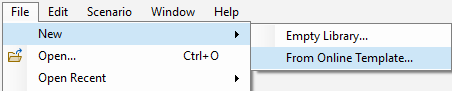
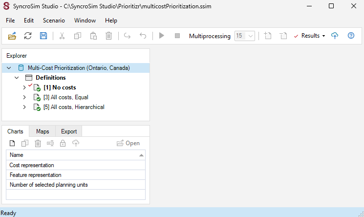

## **Multi-cost Prioritization with prioritizr SyncroSim**

This tutorial provides an overview of working with **prioritizr** in SyncroSim Studio to demonstrate how to integrate multiple cost-layers into a lake conservation problem in Ontario, Canada. It covers the following steps:

1. <a href="#step-1">Creating and configuring the prioritizr **Multi-cost prioritiation for FMZ10 lakes (Ontario, Canada)** SyncroSim library</a>
2. <a href="#step-2">Visualizing and comparing results across scenarios</a>

 

 <h3><b>Step 1. Creating and configuring the Multi-cost Lake Prioritiation (Ontario, Canada) library</b></h3> 

In SyncroSim, a library is a file with extension *.ssim* that stores all the model's inputs and outputs in a format specific to a given package. To recreate the **Multi-cost Lake Prioritiation (Ontario, Canada)** library:

1\. Open SyncroSim Studio.

2\. In this example, you will review a pre-configured library. To do so, select **File > New > From Online Template...**

a. From the list of packages, select <b>prioritizr</b>. 

  

b. Four template library options will be available: Spatial Formulation Example, Tabular Formulation Example, Climate Refugia Prioritization (Muskoka, Ontario), and Multi-cost Lake Prioritization (Onatrio, Canada). Select the <b>Multi-cost Lake Prioritization (Onatrio, Canada)</b> template library.

  

c. If desired, you may edit the <i>File name</i>, and change the <i>Folder</i> by clicking on the <b>Browse</b> button. 

  

d. When done, click <b>OK</b>.

 

A new library has been created based on the selected template and SyncroSim will have automatically opened and displayed it in the *Explorer* window.

3\.	Double-click on the library name, **Multi-cost Lake Prioritization (Onatrio, Canada)**, to open the library properties window. You may also right-click on the library name and select **Open** from the context menu.

 

4\.	The **Summary** datasheet contains the metadata for the library.

 

5\.	Next, navigate to the **Systems** tab, **Options** node, **General** datasheet, and mark the checkbox for *Use conda*.

 

6\.	Close the library properties window.

 

Next, you will review the target feature data for the conservation prioritization problem.

7\. From the *Explorer* window, right-click on **Definitions** and select **Open** from the context menu.

8\. Under the **Prioritizr** tab, select the **Features** datasheet, describing the variables that will be taken into account in the prioritization process. Here, our feature data corresponds to different conservation interests including mean lake depth (*i.e.*, MeanDepth), and lake surface area (*i.e.*, SurfaceArea).

 

9\. Open the **Cost variables** datasheet to review the binary variables that represent whether a lake (*i.e.*, planning unit) has a protection cost(1) or not (0).

 

Now you will review the inputs for the **No cost** scenario. In SyncroSim, scenarios contain the model inputs and outputs associated with a model run.

9\.	In the *Explorer* window, select the pre-configured scenario **No cost** and double-click it to open its properties. You may also right-click on the scenario name and select **Open** from the context menu.

This scenario provides a baseline for prioritizing 30% of lakes in Ontario, Canada based on the mean depth and surface area, and using a minimum shortfall objective. Note that, in this scenario, *no* cost layers are considered.

 

