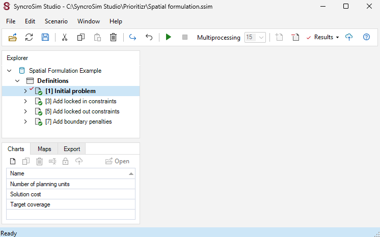
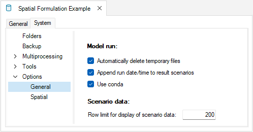

<!-- Update template library so that only scenario 1 comes added to scenario results (i.e., selected, bold) !-->

## **Spatial conservation prioritization with prioritizr SyncroSim**

This tutorial provides an overview of working with **prioritizr** in SyncroSim Studio to create and solve a spatial conservation problem. It covers the following steps:

1. <a href="#step-1">Creating a prioritizr SyncroSim library</a>
2. <a href="#step-2">Visualizing and comparing results across scenarios</a>

 

 <h3><b>Step 1. Creating a prioritizr SyncroSim library</b></h3> 

In SyncroSim, a library is a file with extension *.ssim* that stores all the model's inputs and outputs in a format specific to a given package. To create a new **prioritizr** library:

1\. Open SyncroSim Studio.

2\. In this example, you will review a pre-configured library. To do so, select **File > New > From Online Template...**

a. From the list of packages, select <b>prioritizr</b>. 
  
b. Three template library options will be available: Spatial Formulation Example, Tabular Formulation Example, and Climate Refugia Prioritization (Muskoka, Ontario). Select the <b>Spatial Formulation Example</b> template library.
  
c.  If desired, you may edit the <i>File name</i>, and change the <i>Folder</i> by clicking on the <b>Browse</b> button. 
  
d. When done, click <b>OK</b>.

 

A new library has been created based on the selected template and SyncroSim will have automatically opened and displayed it in the *Explorer* window. This library reproduces the example available in the prioritizr R package [documentation](https://prioritizr.net/index.html#usage){:target="_blank"}. 

3\.	Double-click on the library name, **Spatial Formulation Example**, to open the library properties window. You may also right-click on the library name and select **Open** from the context menu.

4\.	The *Summary* datasheet contains the metadata for the library.

5\.	Next, navigate to the **System** tab, **Options** node, **General** datasheet, and mark the checkbox for <i>Use conda</i>.

6\.	Close the library properties window.

 

Next, you will review the target feature data for the conservation prioritization problem. 

7\. From the *Explorer* window, right-click on **Definitions** and select **Open** from the context menu. 

8\. Under the **Prioritizr** tab, select the **Features** datasheet, describing the variables that will be taken into account in the prioritization process. In this library, note that the feature data corresponds to different bird species. 

 

Now, you will review the inputs for the **Initial problem** scenario, which sets up the initial problem formulation out of which the other scenarios are built. In SyncroSim, each scenario contains the model inputs and outputs associated with a model run. 

9\.	In the *Explorer* window, select the pre-configured scenario **Initial problem** and double-click it to open its properties. You may also right-click on the scenario name and select **Open** from the context menu.

10\.	Navigate to the **Pipeline** datasheet. Pipeline stages call on a transformer (*i.e.*, script) which takes the inputs from SyncroSim, runs a model, and returns the results to SyncroSim. Under the *Stage* column, note that a single pipeline stage is set, called *Base Prioritization*.

11\. Navigate to the **Prioritizr** tab, and expand the **Base Prioritization > Data** nodes. 

  a. Open the <b>Input Format</b> datasheet and note that <i>Data Type</i> is set to <i>Spatial</i> in order to generate a spatial prioritization.

  b. Open the <b>Spatial Inputs</b> datasheet, and review the following inputs:

  

  

    i. <i>Planning Units</i> – a raster file of Washington (USA) in which each cell represents a different planning unit, and cell values denote land acquisition costs.
      
  
      
    ii. <i>Features</i> – a multi-layer raster file of the conservation feature data (i.e., bird species). Layers describe the spatial distribution of each bird species, where cell values denote the relative abundance of individuals.
      
  
  

12\. Expand the **Parameters** node. 

  a. Open the <b>Objective</b> datasheet, and review the following inputs:
   
  

    i. <i>Function</i> – this input sets the prioritization objective for the conservation planning problem. In this example, it is set to <i>Minimum shortfall</i>, which aims to minimize the fraction of each target that remains unmet for as many features as possible while staying within a fixed budget.
      
    ii. <i>Budget</i> – this number represents the maximum allowed cost of the prioritization. Specifically, this value is set to <i>$8,748.4910</i>, which represents 5% of the total land value in the study area.
  

  b. Open the <b>Target</b> datasheet, and review the following inputs:
   
  

    i. <i>Function</i> – is set to <i>Relative</i> so that the target may be defined as a proportion (between 0 and 1) of the desired level of feature representation in the study area.
      
    ii. <i>Amount</i> – specifies the desired level of feature representation in the study area. In this example, it is set to <i>0.2</i>, so that each feature would have 20% of its distribution covered by the prioritization.
  

  c. Open the <b>Decision Types</b> datasheet, and review the following input:
   
  

    i. <i>Function</i> – the decision type is set to <i>Binary</i>, so that planning units are either selected or not for prioritization. 
  

  d. Open the <b>Solver</b> datasheet, and review the following inputs:
   
  

    i. <i>Function</i> – is set to <i>Default</i>. This specifies that the best solver currently available in your computer should be used to solve the conservation planning problem. 
      
    ii. <i>Gap</i> – represents the gap to optimality, and is set to a default value of <i>0.1</i>. This gap is relative and expresses the acceptable deviance from the optimal objective. In this example, a value of 0.1 will result in the solver stopping when it has found a solution within 10% of optimality. 
  

13\. Expand the **Output Options** node and open the **Performance** datasheet to review the following inputs set to *Yes*:

  

    i. <i>Number summary</i> – calculates the number of planning units selected within a solution to the conservation planning problem.
      
    ii. <i>Cost Summary</i> – calculates the total cost of the solution to the conservation planning problem.
      
    iii. <i>Target Coverage Summary</i> – calculates how well the feature representation targets are met by the solution to the conservation planning problem. 
  

 

 <h3><b>Step 2. Visualizing and comparing results across scenarios</b></h3> 

The *Spatial Formulation Example* template library already contains the results for each scenario. Before exploring additional scenarios, you will view the main results for the **Initial problem** scenario. 

1\. In the *Explorer* window, expand the **Initial Problem > Results** node to reveal the **Inital Problem** results scenario.

2\. Collapse the scenario node by clicking on the downward facing arrow beside the scenario name.

3\. Navigate to the **Maps** tab, and double click on the pre-configured **Solution** map.

The *Solution* map shows which planning units have been selected for prioritization given the input data and parameters. Although this solution helps meet the representation targets, it does not account for existing protected areas inside the study area.

4\. Close the results panels.

 

Now, you will review the additional scenarios and explore how they differ from the *Initial problem*.

5\. In the *Explorer* window, expand the **Add locked in constraints > Dependencies** node to reveal the **Initial problem** scenario dependency.

6\.	Select the pre-configured scenario **Add locked in constraints** and double-click it to open its properties. You may also right-click on the scenario name and select **Open** from the context menu.

7\. Navigate to the **Prioritizr** tab, expand the **Base Prioritization > Data** node, and open the **Input Format** datasheet. Notice that this information cannot be edited (<i>i.e.</i>, greyed out) and the *"Inherit values from '[9] Initial Problem'"* checkbox in the bottom left corner is marked. This indicates that values within this datasheet are derived from the **Initial Problem** result scenario acting as a dependency.

8\.  Navigate to the **Prioritizr** tab, expand the **Parameters > Advanced > Constraints** nodes, and open the **Locked In** datasheet to review the following inputs:

  i. <i>Add constraint</i> – set to <i>Yes</i>, ensuring that specific planning units area selected in the solution.
    
  ii. <i>Data</i> – contains the spatial data (<i>i.e.</i>, raster) specifying locations of areas to be locked in (<i>e.g.</i>, protected areas).
  

9\. In the *Explorer* window, right-click on the **Add locked in constraints** scenario, and select **Add to Results** from the context menu. 

10\. Navigate to the **Maps** tab, and double click on the pre-configured **Solution** map. Notice that the **Add locked in constrains** results were added. This solution now accounts for existing protected areas inside the study area.

 

By running the **Add locked in constrains** scenario, we generate an improved solution. However, there are some places in the study area that are not available for protected area establishment (*e.g.*, due to land tenure). Consequently, the solution might not be practical for implementation because it might select some places that are not available for protection. 

 

The **Add locked out constraints** scenario addresses this issue by importing spatial data representing which planning units are *not* available for protection, and adding constraints to the problem to ensure they are not selected by the solution.

 

11\.	In the *Explorer* window, expand the **Add locked out constraints > Dependencies** node to reveal the **Add locked in constraints** scenario dependency.

 

12\.  Select the pre-configured scenario **Add locked out constraints** and double-click it to open its properties. You may also right-click on the scenario name and select **Open** from the context menu.

13\.  Navigate to the **Prioritizr** tab, expand the **Base Prioritization > Data** node, and open the **Input Format** datasheet. Notice that this information cannot be edited (i.e., greyed out) and the *“Inherit values from ‘[10] Add locked in constraints’”* checkbox in the bottom left corner is marked. This indicates that values within this datasheet are derived from the **Add locked in constraints** result scenario acting as a dependency.

14\.  Navigate to the **Prioritizr** tab, expand the **Parameters > Advanced > Constraints** node, and open the **Locked Out** datasheet to review the following inputs:

  i. <i>Add constraint</i> - must be set to <i>Yes</i> in order to add constraints to the conservation planning problem to ensure specific planning units area selected (or allocated to a specific zone) in the solution.
    
  ii. <i>Data</i> - contains the spatial data (<i>i.e.</i>, raster) specifying locations of areas to be locked out (<i>e.g.</i>, areas not available for protection).
  

15\.  In the **Explorer** window, right-click on the **Add locked out constraints** scenario, and select **Add to Results** from the context menu.

16\.  Navigate to the **Maps** tab, and double click on the pre-configured **Solution** map. Notice that the **Add locked out constraints** results were added. This solution now accounts for existing areas that are *not* available for protection inside the study area.

 

By running the **Add locked out constraints** scenario, we generate an even better solution. However, the planning units selected from the solution are fairly fragmented. This can cause issues because fragmentation increases management costs and reduces conservation benefits through edge effects.

 

The **Add boundary penalties** scenario addresses this final issue by adding penalties that punish overly fragmented solutions. 

 

17\.	In the *Explorer* window, expand the **Add boundary penalties > Dependencies** node to reveal the **Add locked out constraints** scenario dependency.

 

18\.  Select the pre-configured scenario **Add boundary penalties** and double-click it to open its properties. You may also right-click on the scenario name and select **Open** from the context menu. 

19\.  Navigate to the **Prioritizr** tab, expand the **Base Prioritization > Data** node, and open the **Input Format** datasheet. Notice that this information cannot be edited (i.e., greyed out) and the *“Inherit values from ‘[11] Add locked in constraints’”* checkbox in the bottom left corner is marked. This indicates that values within this datasheet are derived from the **Add locked out constraints** result scenario acting as a dependency.

20\.  Navigate to the **Prioritizr** tab, expand the **Parameters > Advanced > Penalties** node, and open the **Boundary** datasheet to review the following inputs:

  i. <i>Add penalty</i> - must be set to <i>Yes</i> in order to add boundary penalties to the conservation problem to favour solutions that spatially clump planning units together based on the overall boundary length (<i>i.e.</i>, total perimeter).
    
  ii. <i>Penalty</i> - a value used to scale the importance of selecting planning units that are spatially clumped together compared to the main problem objective. Higher penalty values prefer solutions with a higher degree of spatial clumping, whereas smaller penalty values prefer solutions that are more spread out. In this example, the penalty is set to <i>0.003</i>.
    
  iii. <i>Edge factor</i> - a value used to specify the proportion to scale planning unit edges (borders) that do not have any neighboring planning units. In this example, the edge factor is set to <i>0.5</i>.
  

21\. In the **Explorer** window, right-click on the **Add boundary penalties** scenario, and select **Add to Results** from the context menu. 

22\.  Navigate to the **Maps** tab, and double click on the pre-configured **Solution** map. Notice that the **Add boundary penalties** results were added. This solution now accounts for highly fragmented areas inside the study area.

 

<!-- Update numbers  and add a bit more of explanation/commentry !-->
23\. Navigate to the **Charts** tab, and double-click on the first pre-configured chart: **Number of planning units**. Note that the number of planning units increases until we add the boundary penalties. 

24\. Next, double-click on the second pre-configured chart: **Solution cost**. Here, the solution cost is equal across scenarios since the budget was set at $8,748.4910.

25\. Now, double-click on the third pre-configured chart: **Target coverage**. Here, the target coverage is equal across scenarios.

26\. Navigate to the **Maps** tab, and double click on the pre-configured **Solution** map.

 

This tutorial demonstrates how *prioritizr* can be used to build and customize conservation problems, and the solve them to generate solutions. Although we explored a few different scenarios for modifying a conservation problem, this package can specify objectives, constraints, penalties, and decision variables in order to build and customize conservation planning problems to suit your planning scenario.

To create and solve a tabular conservation problem, see the next tutorial <a href="/tabular_formulation">Tabular Formulation Example with prioritizr SyncroSim</a>. 
