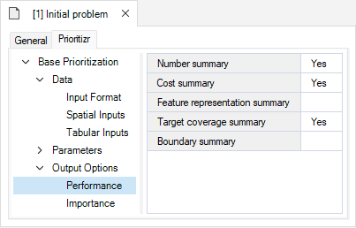
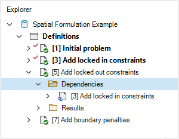
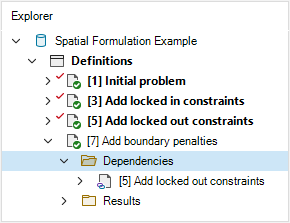

## **Spatial Formulation example with prioritizr SyncroSim**

This tutorial provides an overview of working with **prioritizr** SyncroSim in SyncroSim Studio. It covers the following steps:

1. <A href="#step-1">Creating and configuring a **prioritizr** SyncroSim library</A>
2. <A href="#step-2">Visualizing and comparing results across scenarios</A>

 

 <h3><b>Step 1. Creating and configuring a prioritizr SyncroSim library</b></h3> 

In SyncroSim, a library is a file with extension *.ssim* that stores all the model's inputs and outputs in a format specific to a given package. To create a new prioritizr library:

1\. Open SynrcoSim Studio.

2\. Select **File > New > From Online Template...**

a. From the list of packages, select <b>prioritizr</b>. Three template library options will be available: 1.) Spatial Formulation Example, 2.) Tabular Formulation Example, and 3.) Muskoka Prioritization Example.
  
b. Select the <b>Spatial Formulation Example</b> template library. If desired, you may edit the <i>File name</i>, and change the <i>Folder</i> by clicking on the <b>Browse</b> button. Click <b>OK</b>.

<!--Insert image of template library window-->
<!--img align="center" style="padding: 13px" width="500" src=".assets/images/screenshot8.png"-->

A new library has been created based on the selected template. SyncroSim will automatically open and display it in the Explorer window.

3\.	Double-click on the library name, **Spatial Formulation Example**, to open the library properties window. You may also right-click on the library name and select **Open** from the context menu.

4\.	The *Summary* datasheet contains the metadata for the library.

6\.	Next, navigate to the **Options** tab.

 
Under the <i>General</i>, mark the checkbox for <b>Use conda</b>.

7\.	Close the library properties window.

 

Next, you will review the conservation feature data by right-clicking on **Definitions** and selecting **Open**. Under the **Prioritizr** tab, select **Features**. Here, our feature data corresponds to different bird species.

 

Now, you will review the inputs of each scenario in the **Spatial Formulation Example** library including: 1.) *Initial Problem*, 2.) *Add locked in constraints*, 3.) *Add locked out constraints*, and 4.) *Add boundary penalties*. In SyncroSim, scenarios contain the model inputs and outputs associated with a model run. In this case, each scenario is also set as a dependency on the previous scenario.

1\.	In the *Explorer* window, select the pre-configured scenario **Initial Problem** and double-click it to open its properties. You may also right-click on the scenario name and select **Open** from the context menu.

This scenario sets up our initial problem. In this example, we will use a minimum shortfall objective, with relative targets of 20%, binary decisions, and specify that we want near-optimal solutions.

 

2\.	Navigate to the **Pipeline** datasheet. Pipeline stages call on a transformer (*i.e.*, script) which takes the inputs from SyncroSim, runs a model, and returns the results to SyncroSim. Under the *Stage* column, note that a single pipeline stage is set called *Base Prioritization*. This stage <!--Explain what this stage does-->

 

3\. Navigate to the **Prioritizr** tab, and expand the **Base Prioritization > Data** node. 

  a. Click on the <i>Input Format</i> node and notice that <i>Data Type</i> is set to <i>Spatial</i> in order to generate a spatial prioritization.

  b. Navigate to the <i>Spatial Inputs</i> node, and review the following inputs:
   
  

    i. <i>Planning Units</i> - a raster file of Washington, USA in which each cell represents a different planning unit, and cell values denote land acquistition costs. Specifically, there are 10,757 planning units in total (<i>i.e.</i>, cells with non-missing values) <!-- confirm this makes sense -->
      
    ii. <i>Features</i> - a multi-layer raster file of the conservation feature data. Each layer describes the spatial distribution of a feature. Here, our feature data correspond to different bird species. To account for migratory patterns, the breeding and non-breeding distributions of species are represented as different features. Specifically, the cell values denote the relative abundance of individuals, with higher values indicating greater abundance.
  

 

4\. Expand the **Base Prioritization > Parameters** node. 

  a. Click on the <i>Objective</i> node, and review the following inputs:
   
  

    i. <i>Function</i> - this input sets the objective of a conservation planning problem. In this example, it is set to <i>Minimum shortfall</i> which aims to minimize the overall shortfall for as many targets as possible while ensuring that the cost of a solution does not exceed a budget.
      
    ii. <i>Budget</i> - this number represents the total cost of the prioritization. Specifically, this value is set to <i>$8,748.4910</i> which represents 5% of the total land value in the study area.
  

  b. Click on the <i>Target</i> node, and review the following inputs:
   
  

    i. <i>Function</i> - since this input is set to <i>Relative</i>, the targets are set as a proportion (between 0 and 1) of the maximum level of representations of features in the study area.
      
    ii. <i>Amount</i> - specifies the proportion. In this example, it is set to <i>0.2</i>.
  

  c. Click on the <i>Decision Types</i> node, and review the following input:
   
  

    i. <i>Function</i> - is set to <i>Binary</i>. Here, we are adding a binary decision to a conservation planning problem (<i>i.e.</i>, to prioritize or not prioritize a planning unit). 
  

  d. Click on the <i>Solver</i> node, and review the following inputs:
   
  

    i. <i>Function</i> - is set to <i>Default</i>. This specifies that the best solver currently available should be used to solve a conservation planning problem. 
      
    ii. <i>Gap</i> - represents the gap to optimality and is set to a default value of <i>0.1</i>. This gap is relative and expresses the acceptable deviance from the optimal objective. In this example, a value of 0.1 will result in the solver stopping when it has found a solution within 10% of optimality. 
  

 

5\. Exapnd the **Output Options** node and click on **Performance** to review the following inputs:

  a. Click on the <i>Objective</i> node, and review the following inputs set to *Yes*:
   
  

    i. <i>Number Summary</i> - calculates the number of planning units selected within a solution to a the conservation planning problem.
      
    ii. <i>Cost Summary</i> - calculates the total cost of the solution to the conservation planning problem.
      
    iii. <i>Target Coverage Summary</i> - calculates how well feature representation targets are met by a solution to the conservation planning problem 
  

 

By running the **Initial problem** scenario, we generate a solution that helps meet the representation targets. However, it does not account for existing protected areas inside the study area. Therefore, it does not account for the possibility that some features could be paritally - or even fully - represented by existing protected areas and, in turn, might fail to identify meaningful priorities for new protected areas. 

 

The **Add locked in constraints** scenario addresses this issue by importing spatial data for protected areas in the study area, and adding constraints to the problem to ensure they are selected by the solution.

6\.	In the *Explorer* window, select the pre-configured scenario **Add locked in constraints** and double-click it to open its properties. You may also right-click on the scenario name and select **Open** from the context menu.

> *Note: the **Add locked in constraints** scenario is dependent on the **Initial problem** scenario. We can see this in the Explorer window by expanding the **Add locked in constrains > Dependencies** node.*

 

7\. Navigate to the **Prioritizr** tab and expand the **Parameters > Advanced > Constraints** node. Open the **Locked In** window to review the following inputs:

  i. <i>Add constraint</i> - must be set to *Yes* in order to add constraints to the conservation planning problem to ensure specific planning units area selected (or allocated to a specific zone) in the solution.
    
  ii. <i>Data</i> - contains the spatial data (<i>i.e.</i>, raster) specifying locations of areas to be locked in (<i>e.g.</i>, protected areas).
  

 

By running the **Add locked in constrains** scenario, we generate an improved solution. However, there are some places in the study area that are not available for protected area estalishment (*e.g.*, due to land tenure). Consequently, the solution might not be practical for implementation because it might select some places that are not available for protection. 

 

The **Add locked out constraints** scenario addresses this issue by importing spatial data representing which planning units are *not* available for protection, and adding constraints to the problem to ensure they are not selected by the solution.

 

8\.	In the *Explorer* window, select the pre-configured scenario **Add locked out constraints** and double-click it to open its properties. You may also right-click on the scenario name and select **Open** from the context menu.

> *Note: the **Add locked out constraints** scenario is dependent on the **Add locked in constraints** scenario. We can see this in the Explorer window by expanding the **Add locked out constrains > Dependencies** node.*

 

9\. Navigate to the **Prioritizr** tab and expand the **Parameters > Advanced > Constraints** node. Open the **Locked Out** window to review the following inputs:

  i. <i>Add constraint</i> - must be set to *Yes* in order to add constraints to the conservation planning problem to ensure specific planning units area selected (or allocated to a specific zone) in the solution.
    
  ii. <i>Data</i> - contains the spatial data (<i>i.e.</i>, raster) specifying locations of areas to be locked out (<i>e.g.</i>, areas not available for protection).
  

 

By running the **Add locked out constraints** scenario, we generate an even better solution. However, the planning units selected from the solution are fairly fragmented. This can cause issues because fragmentation increases management costs and reduces conservation benefits through edge effects.

 

The **Add boundary penalties** scenario addresses this final issue by adding penalties that punish overly fragmented solutions. 

 

10\.	In the *Explorer* window, select the pre-configured scenario **Add boundary penalties** and double-click it to open its properties. You may also right-click on the scenario name and select **Open** from the context menu.

> *Note: the **Add boundary penalties** scenario is dependent on the **Add locked out constraints** scenario. We can see this in the Explorer window by expanding the **Add bounary penalties > Dependencies** node.*

 

11\. Navigate to the **Prioritizr** tab and expand the **Parameters > Advanced > Penalties** node. Open the **Boundary** window to review the following inputs:

  i. <i>Add penalty</i> - must be set to *Yes* in order to add boundary penalties to the conservation problem to favour solutions that spatially clump planning units together based on the overall boundary length (<i>i.e.</i>, total perimeter).
    
  ii. <i>Penalty</i> - a value used to scale the importance of selecting planning units that are spatially clumped together compared to the main problem objective. Higher penalty values prefer solutions with a higher degree of spatial clumping, whereas smaller penalty values prefer solutions that are more spread out. In this example, the penalty is set to *0.003*.
    
  iii. <i>Edge factor</i> - a value used to specify the proportion to scale planning unit edges (borders) that do not have any neighboring planning units. In this example, the edge factor is set to *0.5*.
  

 

 <h3><b>Step 2. Visualizing and comparing results across scenarios</b></h3> 

The **Spatial Formulation Example** template library already contains the results for each scenario. In SyncroSim, the results for a scenario are organized into a *Results* folder, nested within its parent scenario.

<!-- Go into each scenario's results folder? Or just the Add boundary penalties results?-->

1\. Navigate to the **Charts** tab, and double-click on the first pre-configured chart: **Number of planning units**. 

2\. Next, double-click on the second pre-configured chart: **Solution cost**.

3\. Now, double-click on the third pre-configured chart: **Target coverage**

4\. Nagivate to the **Maps** tab, and double click on the pre-configured **Solution** map.

These map display areas of *Selected* (purple), and *Not selected* (yellow) planning units in our study area (Washington, USA).

