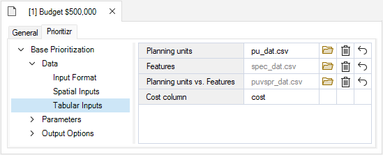
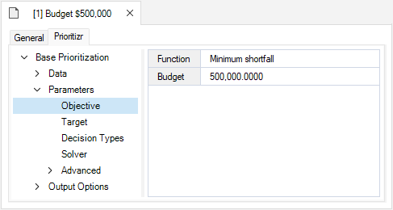
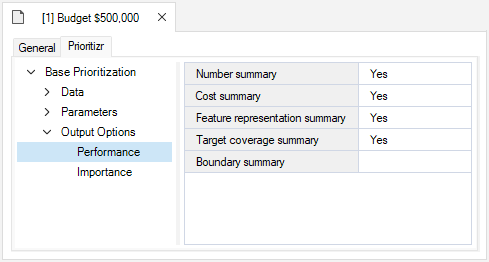
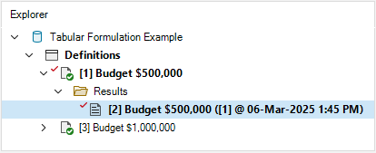
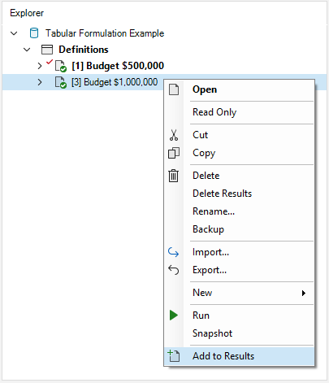
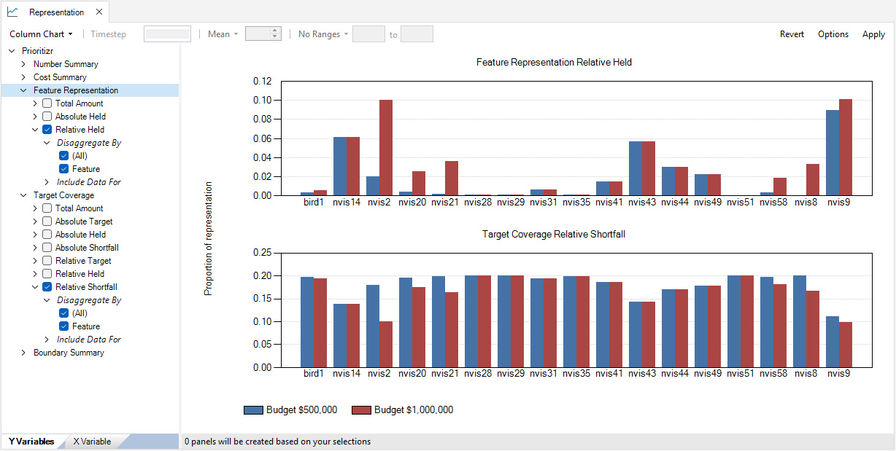

## **Tabular conservation prioritization with prioritizr SyncroSim**

This tutorial provides an overview of working with **prioritizr** in SyncroSim Studio to create and solve a tabular conservation problem. Here, you will review a pre-configured library that uses data derived from the prioritizr R package [documentation](https://prioritizr.net){:target="_blank"}. It covers the following steps:

1. <a href="#step-1">Creating a prioritizr SyncroSim library</a>
2. <a href="#step-2">Visualizing and comparing results across scenarios</a>

 

 <h3><b>Step 1. Creating a prioritizr SyncroSim library</b></h3> 

In SyncroSim, a library is a file with extension *.ssim* that stores all the model's inputs and outputs in a format specific to a given package. To load the pre-configured library:

1\. Open **SyncroSim Studio**.

2\. Select **File > New > From Online Template...**.

a. From the list of packages, select <b>prioritizr</b>. 
  

  
b. From the list of template libraries, select the <b>Tabular Formulation Example</b>.
  

  
c.  If desired, you may edit the <i>File name</i>, and change the <i>Folder</i> by clicking on the <b>Browse</b> button. 
  
d. When done, click <b>OK</b>.

 

A new library has been created based on the selected template, and SyncroSim will have automatically opened and displayed it in the *Explorer* window.

3\.	Double-click on the library name, **Tabular Formulation Example**, to open the library properties window. You may also right-click on the library name and select **Open** from the context menu.

4\.	The **Summary** datasheet contains the metadata for the library.

5\.	Next, navigate to the **System** tab, **Options** node, **General** datasheet, and make sure <b>Use conda</b> is disabled.

6\.	Close the library properties window.

 

Next, you will review the target feature data for the conservation prioritization problem. 

7\. From the *Explorer* window, right-click on **Definitions** and select **Open** from the context menu. 

8\. Under the **Prioritizr** tab, select the **Features** datasheet, which lists the variables that will be taken into account in the prioritization process. This datasheet was automatically populated once the first scenario was run.

 

Now, you will review the inputs for the **Budget $500,000** scenario. In SyncroSim, scenarios contains the model inputs associated with a model run.

9\.	In the *Explorer* window, select the pre-configured scenario **Budget $500,000** and double-click it to open its properties. You may also right-click on the scenario name and select **Open** from the context menu.

10\.	Navigate to the **Pipeline** datasheet. Pipeline stages call on a transformer (*i.e.*, script) which takes the inputs from SyncroSim, runs a model, and returns the results to SyncroSim. Under the *Stage* column, note that a single pipeline stage is set called *Base Prioritization*.

11\. Navigate to the **Prioritizr** tab and expand the **Base Prioritization > Data** nodes. 

  a.  Open the <b>Input Format</b> datasheet and review the following inputs:
  

    i. <i>Data Type</i> – set to <i>Tabular</i> in order to setup a tabular formulation of the conservation problem. This means that csv files are provided as input.
  

  b. Open the <b>Tabular Inputs</b> datasheet, and review the following inputs. 

  

    i. <i>Planning Units</i> – a data table of the different planning units in Washington (USA), where each planning unit is associated with a specific ID and cost value. In this example, there are 1,751 planning units. The columns <i>status</i>, <i>xloc</i> and <i>yloc</i> are optional fields and not used in this analysis.
     
    
      
    ii. <i>Features</i> – a data table listing the feature variables. These are listed under the column <i>name</i>, with an associated ID. The other columns displayed here are optional fields and not used in this example.
     
      
      
    iii. <i>Planning units vs. Features</i> – a data table listing, for each planning unit (under the <i>pu</i> column), the value (under the <i>amount</i> column) associated with each feature variable (under the <i>species</i> column).
     
    
      
  

12\. Expand the **Parameters** node. 

  a. Open the <b>Objective</b> datasheet and review the following inputs:
   
  

    i. <i>Function</i> – this input sets the prioritization objective for the conservation planning problem. In this example, it is set to <i>Minimum shortfall</i>, which aims to minimize the fraction of each target that remains unmet for as many features as possible while staying within a fixed budget.
      
    ii. <i>Budget</i> – this number represents the total cost of the prioritization. Specifically, this value is set to <i>$500,000</i>.
  

  b. Open the <b>Target</b> datasheet and review the following inputs:
   
  

    i. <i>Function</i> – is set to <i>Relative</i> so that the target may be defined as a proportion (between 0 and 1) of the desired level of feature representation in the study area.
      
    ii. <i>Amount</i> – specifies the desired level of feature representation in the study area. In this example, it is set to 0.2, so that each feature would ideally have 20% of its distribution covered by the prioritization.

  

  c. Open the <b>Decision Types</b> datasheet and review the following input:
   
  

    i. <i>Function</i> – the decision type is set to <i>Binary</i>, so that planning units are either selected or not for prioritization. 
  

  d. Open the <b>Solver</b> datasheet and review the following inputs:
   
  

    i. <i>Function</i> – is set to <i>Default</i>. This specifies that the best solver currently available in your computer should be used to solve the conservation planning problem. 
      
    ii. <i>Gap</i> – represents the gap to optimality, and is set to a default value of <i>0.1</i>. This gap is relative and expresses the acceptable deviance from the optimal objective. In this example, a value of 0.1 will result in the solver stopping when it has found a solution within 10% of optimality. 
  

13\. Expand the **Output Options** node and open the **Performance** datasheet to review the following inputs set to *Yes*:

  

    i. <i>Number summary</i> – calculates the number of planning units selected in the solution to the conservation planning problem.
      
    ii. <i>Cost summary</i> – calculates the total cost of the solution to the conservation planning problem.
      
    iii. <i>Feature representation summary</i> – calculates the amount of each feature covered in the solution to the conservation planning problem.
      
    iv. <i>Target coverage summary</i> – calculates how well feature representation targets are met by the solution to the conservation planning problem. 
  

 

 <h3><b>Step 2. Visualizing and comparing results across scenarios</b></h3> 

The *Tabular Formulation Example* template library already contains the results for each scenario. Before exploring the additional scenario, you will view the main result for the **Budget $500,000** scenario.

1\. In the *Explorer* window, expand the **Budget $500,000 > Results** nodes to reveal the **Budget $500,000** results scenario. This scenario contains the outputs of the model run, it is timestamped, and has a copy of all the input parameters. Double-click it to open its properties. You may also right-click on the result scenario name and select **Open** from the context menu.

2\. Navigate to the **Prioritizr** tab, expand the **Results > Tabular** nodes, and select the **Solution** datasheet to analyse the results table.

  a.  Click on the <b>Solution</b> column to reorder the table's contents in decreasing order. <i>Solution</i> values equal to 1 represent the planning units that were selected by the solution. 

3\. Close the tab and from the *Explorer* window, collapse the scenario node by clicking on the downward facing arrow beside the scenario name.

 

Now you will review the additional scenario and explore how it differs from the **Budget $500,000** scenario. 

4\. In the *Explorer* window, select the pre-configured scenario **Budget $1,000,000**, and double-click it to open its properties. You may also right-click on the scenario name and select **Open** from the context menu.

5\. Navigate to the **Prioritizr** tab, expand the **Parameters** node, and open the **Objective** datasheet. Here, the budget for the **Budget $1,000,000** scenario is double that of the **Budget $500,000** scenario. Note that all other inputs remain the same.

6\. In the *Explorer* window, right-click on the **Budget $1,000,000** scenario, and select **Add to Results** from the context menu.

7\. Navigate to the **Charts** tab, and double-click on the pre-configured **Cost of the solution** chart. Here, note the difference in solution cost matches the budget set in each scenario.

8\. Next, double-click on the pre-configured **Number of selected planning units** chart. In this case, with a larger budget more planning units were covered by the solution.

9\. Now, double-click on the pre-configured **Representation** chart. The upper chart shows the proportion of each feature covered by the solution under the different scenarios. In turn, the bottom chart shows the respective deviation from the target coverage of 20%. The results indicate that an even larger budget is needed for the 20% target to be met.

 

This tutorial demonstrated how **prioritizr** can be used to build tabular formulations of conservation problems. Next, to explore how to further customize a conservation problem with feature weights, see the next tutorial <a href="tutorials/climate_refugia_prioritization">Climate refugia prioritization with prioritizr SyncroSim</a>. 

   