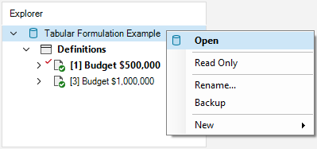
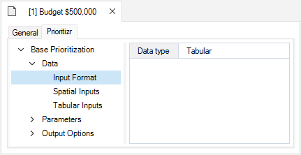
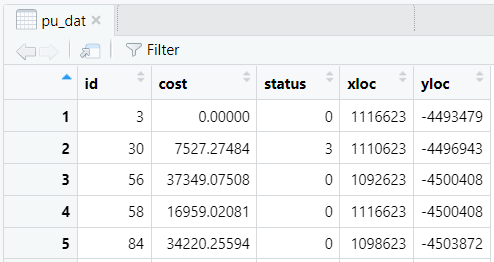
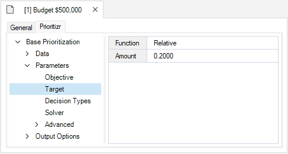
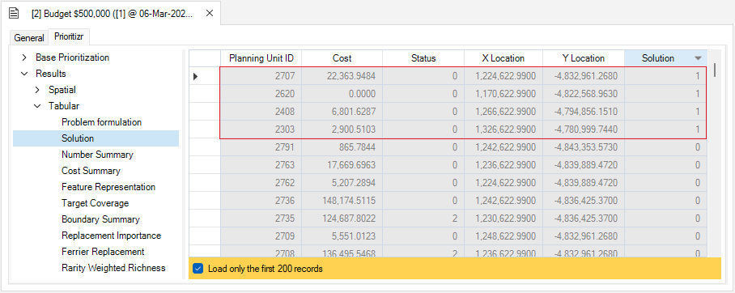

## **Tabular Formulation example with prioritizr SyncroSim**

This tutorial provides an overview of working with **prioritizr** in SyncroSim Studio to create and solve a tabular conservation problem. It covers the following steps:

1. <a href="#step-1">Creating a prioritizr SyncroSim library</a>
2. <a href="#step-2">Visualizing and comparing results across scenarios</a>

 

 <h3><b>Step 1. Creating a prioritizr SyncroSim library</b></h3> 

In SyncroSim, a library is a file with extension *.ssim* that stores all the model's inputs and outputs in a format specific to a given package. To create a new **prioritizr** library:

1\. Open SyncroSim Studio.

2\. In this example, you will review a pre-configured library. To do so, select **File > New > From Online Template...**

a. From the list of packages, select <b>prioritizr</b>. 
  
b. Three template library options will be available: Spatial Formulation Example, Tabular Formulation Example, and Climate Refugia Prioritization (Muskoka, Ontario). Select the <b>Tabular Formulation Example</b> template library.
  
c.  If desired, you may edit the <i>File name</i>, and change the <i>Folder</i> by clicking on the <b>Browse</b> button. 
  
d. When done, click <b>OK</b>.

 

A new library has been created based on the selected template and SyncroSim will have automatically opened and displayed it in the *Explorer* window. Data for this example was derived from the [prioritizr R package](https://prioritizr.net){:target="_blank"}. 

3\.	Double-click on the library name, **Tabular Formulation Example**, to open the library properties window. You may also right-click on the library name and select **Open** from the context menu.

4\.	The **Summary** datasheet contains the metadata for the library.

5\.	Next, navigate to the **System** tab, **Options** node, **General** datasheet, and mark the checkbox for <i>Use conda</i>.

6\.	Close the library properties window.

 

Next, you will review the target feature data for the conservation prioritization problem. 

7\. From the *Explorer* window, right-click on **Definitions** and select **Open** from the context menu. 

8\. Under the **Prioritizr** tab, select the **Features** datasheet, describing the variables that will be taken into account in the prioritization process. 

 

Now, you will review the inputs for the **Budget $5,000** scenario. In SyncroSim, scenarios contain the model inputs and outputs associated with a model run.

1\.	In the *Explorer* window, select the pre-configured scenario **Budget $5,000** and double-click it to open its properties. You may also right-click on the scenario name and select **Open** from the context menu.

<!--Necessary to add this: -->
<!--This scenario sets up our initial problem. In this example, we will use a minimum shortfall objective, with relative targets of 20%, binary decisions, and specify that we want near-optimal solutions-->.

 

2\.	Navigate to the **Pipeline** datasheet. Pipeline stages call on a transformer (*i.e.*, script) which takes the inputs from SyncroSim, runs a model, and returns the results to SyncroSim. Under the *Stage* column, note that a single pipeline stage is set called *Base Prioritization*.

 

3\. Navigate to the **Prioritizr** tab, and expand the **Base Prioritization > Data** nodes. 

  a. Open the <b>Input Format</b> datasheet and note that <i>Data Type</i> is set to <i>Tabular</i> in order to generate a tabular prioritization.

  b. Open the <b>Tabular Inputs</b> datasheet, and review the following inputs:
   
  

    i. <i>Planning Units</i> - a data table of the different planning units in Washington, USA in which planning unit is associated with a specific ID, and cost value. In this example, there are 1,751 planning units.
      
      
      
    ii. <i>Features</i> - a data table of the conservation feature data.
      
      
      
    iii. <i>Planning units vs. Features</i> - a data table of the features associated with each planning unit <!--confirm correct definition-->.
      
      
      
  

 

4\. Expand the **Parameters** node. 

  a. Open the <b>Objective</b> datasheet, and review the following inputs:
   
  

    i. <i>Function</i> - this input sets the prioritization objective for the conservation planning problem. In this example, it is set to <i>Minimum shortfall</i> which aims to minimize the fraction of each target that remains unmet for as many features as possible while staying within a fixed budget.
      
    ii. <i>Budget</i> - this number represents the total cost of the prioritization. Specifically, this value is set to <i>$5,000</i> which represents 5% of the total land value in the study area.
  

  b. Open the <b>Target</b> datasheet, and review the following inputs:
   
  

    i. <i>Function</i> - is set to <i>Relative</i> so that the target may be defined as a proportion (between 0 and 1) of the desired level of feature representation in the study area.
      
    ii. <i>Amount</i> - specifies the desired level of feature representation in the study area. In this example, it is set to 0.2, so that each feature would have 20% of its distribution covered by the prioritization.

  

  c. Open the <b>Decision Types</b> datasheet, and review the following input:
   
  

    i. <i>Function</i> - the decision type is set to Binary, so that planning units are either selected or not for prioritization. 
  

  d. Open the <b>Solver</b> datasheet, and review the following inputs:
   
  

    i. <i>Function</i> - is set to <i>Default</i>. This specifies that the best solver currently available in your computer should be used to solve the conservation planning problem. 
      
    ii. <i>Gap</i> - represents the gap to optimality, and is set to a default value of <i>0.1</i>. This gap is relative and expresses the acceptable deviance from the optimal objective. In this example, a value of 0.1 will result in the solver stopping when it has found a solution within 10% of optimality. 
  

 

5\. Expand the **Output Options** node and open the **Performance** datasheet to review the following inputs set to *Yes*:

  

    i. <i>Number Summary</i> - calculates the number of planning units selected within a solution to the conservation planning problem.
      
    ii. <i>Cost Summary</i> - calculates the total cost of the solution to the conservation planning problem.
      
    iii. <i>Target Coverage Summary</i> - calculates how well feature representation targets are met by a solution to the conservation planning problem 
  

 

 <h3><b>Step 2. Visualizing and comparing results across scenarios</b></h3> 

The *Tabular Formulation Example* template library already contains the results for each scenario. Before exploring additional scenarios, you will view the main results for the **Budget $5,000** scenario.

1\. In the *Explorer* window, expand the **Budget $5,000 > Results** node to reveal the **Budget $5,000** results scenario. Double-click it to open its properties. You may also right-click on the result scenario name and select **Open** from the context menu.

2\. Collapse the scenario node by clicking on the downward facing arrow beside the scenario name.

3\. Navigate to the **Prioritizr** tab, and expand the **Results > Tabular** node. Select the **Solution** datasheet to analyse the results table. To view which planning units were selected (1), and their associated costs, click on the *Solution* column to reorder the table's contents.

 

Now you will review the additional scenario and explore how it differs from the **Budget $5,000** scenario. 

4\. In the *Explorer* winow, select the pre-configured scenario **Budget $10,000**, and double-click it to open its properties. You may also right-click on the scenario name and select **Open** from the context menu.

5\. Navigate to the **Prioritizr** tab, expand the **Parameters** node, and open the **Objective** datasheet. Here, the budget for the **Budget $10,000** scenario is double that of the **Budget $5,000** scenario. Note that all other inputs remain the same.

6\. In the *Explorer* window, right-click on the **Budget $10,000** scenario, and select **Add to Results** from the context menu.

By running the **Budget $10,000** scenario, we generate another solution that helps meet the representation targets, although with a larger budget.

7\. Navigate to the **Charts** tab, and double-click on the first pre-configured chart: **Number of selected planning units**. Since our goal was to represent 20% of the features in the solution(s), the number of selected planning units does not necesarily increase when we increase the budget.

8\. Next, double-click on the second pre-configured chart: **Solution cost**. Here, we can see the difference in solution cost based on the budget set in each scenario.

9\. Now, double-click on the third pre-configured chart: **Target coverage**. Here, we can see the solutions that meet the target for each variable without exceeding the associated budget.

