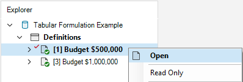
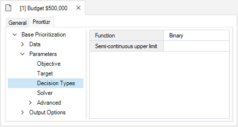
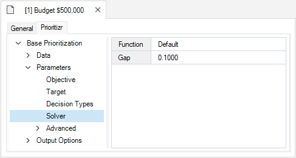
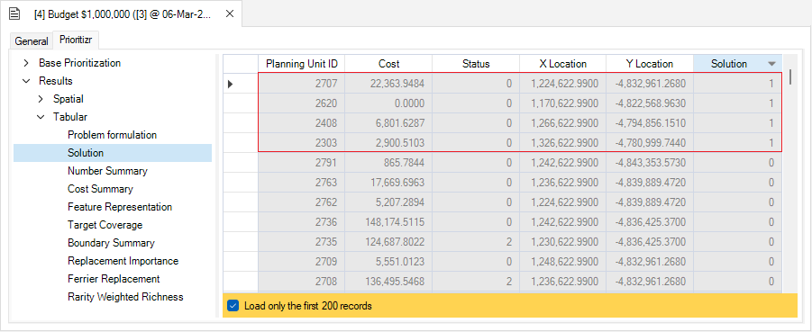
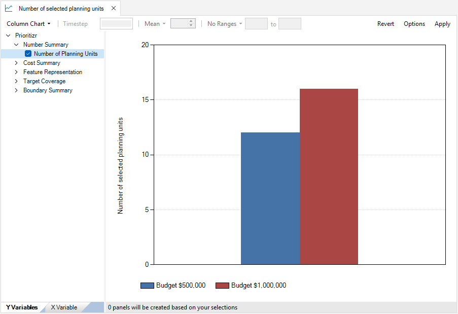

## **Tabular Formulation example with prioritizr SyncroSim**

This tutorial provides an overview of working with **prioritizr** SyncroSim in SyncroSim Studio. It covers the following steps:

1. <A href="#step-1">Creating and configuring a **prioritizr** SyncroSim library</A>
2. <A href="#step-2">Visualizing and comparing results across scenarios</A>

 

 <h3><b>Step 1. Creating and configuring a prioritizr SyncroSim library</b></h3> 

In SyncroSim, a library is a file with extension *.ssim* that stores all the model's inputs and outputs in a format specific to a given package. To create a new prioritizr library:

1\. Open SyncroSim Studio.

2\. Select **File > New > From Online Template...**

a. From the list of packages, select <b>prioritizr</b>. Three template library options will be available: 1.) Spatial Formulation Example, 2.) Tabular Formulation Example, and 3.) Climate Refugia Prioritization (Muskoka, Ontario).
  
b. Select the <b>Tabular Formulation Example</b> template library. If desired, you may edit the <i>File name</i>, and change the <i>Folder</i> by clicking on the <b>Browse</b> button. Click <b>OK</b>.

<!--Insert image of template library window-->
<!--img align="center" style="padding: 13px" width="500" src=".assets/images/screenshot34.png"-->

A new library has been created based on the selected template. SyncroSim will automatically open and display it in the Explorer window.

3\.	Double-click on the library name, **Tabular Formulation Example**, to open the library properties window. You may also right-click on the library name and select **Open** from the context menu.

4\.	The **Summary** datasheet contains the metadata for the library.

5\.	Next, navigate to the **Systems > Options** node.

 
Under <i>General</i>, mark the checkbox for <i>Use conda</i>.

6\.	Close the library properties window.

 

Next, you will review the conservation feature data by right-clicking on **Definitions** and selecting **Open** in the context menu. Under the **Prioritizr** tab, select **Features**. Here, our feature data corresponds to <!--different bird species?-->.

 

Now, you will review the inputs of each scenario in the **Tabular Formulation Example** library including: 1.) *Budget $5,000*, and 2.) *Budget $10,000*. In SyncroSim, scenarios contain the model inputs and outputs associated with a model run.

1\.	In the *Explorer* window, select the pre-configured scenario **Budget $5,000** and double-click it to open its properties. You may also right-click on the scenario name and select **Open** from the context menu.

This scenario sets up our initial problem. In this example, we will <!--use a minimum shortfall objective, with relative targets of 20%, binary decisions, and specify that we want near-optimal solutions-->.

 

2\.	Navigate to the **Pipeline** datasheet. Pipeline stages call on a transformer (*i.e.*, script) which takes the inputs from SyncroSim, runs a model, and returns the results to SyncroSim. Under the *Stage* column, note that a single pipeline stage is set called *Base Prioritization*.

 

3\. Navigate to the **Prioritizr** tab, and expand the **Base Prioritization > Data** node. 

  a. Click on the <b>Input Format</b> node and notice that <i>Data Type</i> is set to <i>Tabular</i> in order to generate a tabular prioritization.

  b. Navigate to the <b>Tabular Inputs</b> node, and review the following inputs:
   
  

    i. <i>Planning Units</i> - a data table of the different planning units in Washington, USA <!--confirm this is the correct study area--> in which planning unit is associated with a specific ID, and cost value. In this example, there are 1,751 planning units.
      
    ii. <i>Features</i> - a data table of the conservation feature data.
      
    iii. <i>Planning units vs. Features</i> - a data table of the features associated with each planning unit <!--confirm correct definition-->.
  

 

4\. Expand the **Base Prioritization > Parameters** node. 

  a. Click on the <b>Objective</b> node, and review the following inputs:
   
  

    i. <i>Function</i> - this input sets the objective of a conservation planning problem. In this example, it is set to <i>Minimum shortfall</i> which aims to minimize the overall shortfall for as many targets as possible while ensuring that the cost of a solution does not exceed a budget.
      
    ii. <i>Budget</i> - this number represents the total cost of the prioritization. Specifically, this value is set to <i>$5,000</i> <!-- confirm this also represents 5% of the land value in the study area or something else-->.
  

  b. Click on the <b>Target</b> node, and review the following inputs:
   
  

    i. <i>Function</i> - since this input is set to <i>Relative</i>, the targets are set as a proportion (between 0 and 1) of the maximum level of representations of features in the study area.
      
    ii. <i>Amount</i> - specifies the proportion. In this example, it is set to <i>0.2</i>.
  

  c. Click on the <b>Decision Types</b> node, and review the following input:
   
  

    i. <i>Function</i> - is set to <i>Binary</i>. Here, we are adding a binary decision to a conservation planning problem (<i>i.e.</i>, to prioritize or not prioritize a planning unit). 
  

  d. Click on the <b>Solver</b> node, and review the following inputs:
   
  

    i. <i>Function</i> - is set to <i>Default</i>. This specifies that the best solver currently available should be used to solve a conservation planning problem. 
      
    ii. <i>Gap</i> - represents the gap to optimality and is set to a default value of <i>0.1</i>. This gap is relative and expresses the acceptable deviance from the optimal objective. In this example, a value of 0.1 will result in the solver stopping when it has found a solution within 10% of optimality. 
  

 

5\. Expand the **Output Options** node and click on **Performance** to review the following inputs:

  a. Click on the <b>Performance</b> node, and review the following inputs set to *Yes*:
   
  

    i. <i>Number Summary</i> - calculates the number of planning units selected within a solution to a the conservation planning problem.
      
    ii. <i>Cost Summary</i> - calculates the total cost of the solution to the conservation planning problem.
      
    iii. <i>Target Coverage Summary</i> - calculates how well feature representation targets are met by a solution to the conservation planning problem 
  

 

By running the **Budget $5,000** scenario, we generate a solution that helps meet the representation targets.

6\. In the *Explorer* window, expand the **Budget $5,000 > Results** folder and double-click the results scenario to open it. 

 

7\. Navigate to the **Prioritizr** tab, and expand the **Results > Tabular** node. Select the **Solution** node to analyse the results table. To view which planning units were selected (1), and their associated costs, click on the *Solution* column to reorder the table's contents.

 

The **Budget $10,000** scenario is a copy of the **Budget $5,000** scenario; the only difference is its budget is doubled (all other inputs remain the same).

By running the **Budget $10,000** scenario, we generate another solution that helps meet the representation targets, although with a larger budget.

 <h3><b>Step 2. Visualizing and comparing results across scenarios</b></h3> 

The **Tabular Formulation Example** template library already contains the results for each scenario. In SyncroSim, the results for a scenario are organized into a *Results* folder, nested within its parent scenario.

1\. Navigate to the **Charts** tab, and double-click on the first pre-configured chart: **Number of selected planning units**. 

2\. Next, double-click on the second pre-configured chart: **Solution cost**.

3\. Now, double-click on the third pre-configured chart: **Target coverage**.

